# 第1章 绪论
## 1.1 研究背景及意义
软件系统的规模膨胀速度，远超大多数团队测试能力的增长。互联网与移动应用的普及使得版本迭代周期越来越短，传统人工测试暴露出的问题也越来越明显——效率偏低、覆盖面有限、用例难以复用，尤其在敏捷开发与持续交付（CI/CD）场景下，“质量”和“速度”的矛盾更加突出。笔者在调研中发现，不少企业已经意识到：要在高频迭代中守住质量底线，仅靠人力堆砌是不够的，必须依赖一套高效、易用且可扩展的自动化测试平台。
然而，市面上主流的自动化测试工具大多只解决单一问题。有的只做API接口测试，有的只做UI自动化，工具之间各自为战，测试数据与执行结果分散在不同系统里，统一管理无从谈起。技术栈依赖也是个现实障碍。很多工具上手门槛高，普通测试人员甚至业务人员难以快速掌握，测试能力因此很难在团队中真正推广开来。值得注意的是，人工智能技术近几年取得了长足进步，特别是计算机视觉和自然语言处理方向。将这些AI能力引入测试领域——比如用于元素识别、用例生成、结果判定——有可能在保证准确性的前提下把使用门槛再降一个台阶。已有学者从应用路径和UI自动化框架等角度，对人工智能与测试的融合方式进行了探讨[9][11]；OCR、NLP等感知技术也为界面理解和文本理解类的智能测试打下了基础[7][8]。
基于这样的现实需求，本文以B/S（Browser/Server）架构为基础，设计并实现了一套软件测试系统。该系统集成了API测试管理、UI测试管理、可视化步骤编排、AI视觉辅助测试以及测试报告管理等功能。技术选型上，前端采用Vue框架，后端基于Spring Boot，数据持久化使用MySQL数据库，UI自动化测试通过Selenium驱动浏览器执行，部分复杂界面元素的识别与操作则借助AI视觉识别技术来完成。
笔者认为，这项工作的意义可以从四个层面来理解。其一，测试效率与覆盖率的提升。用例、数据、执行结果统一管理之后，API与UI测试实现了一体化，重复性劳动大幅减少，回归测试的效率和覆盖范围都能得到改善。其二，使用门槛的降低。可视化步骤编排配合部分AI辅助能力，让测试人员可以通过图形化方式来组合测试步骤，不必大量编写脚本代码，这对团队中编码经验有限的成员尤为友好。其三，测试过程的标准化与可追溯。测试报告管理和执行历史记录使得整个过程可视、可追踪，为质量评估和缺陷分析提供了数据支撑。其四，系统采用模块化、可扩展的设计思路，后续如果要引入智能用例生成、缺陷预测等更多智能测试能力，现有平台可以直接充当实验基础和技术载体。
## 1.2 国内外研究现状
国外在自动化测试技术方面的研究起步比较早，工具和方法体系相对成熟。在软件系统可测性改造与测试技术演化这条脉络上，已有系统文献综述对其进行了梳理[15]，移动软件测试等场景下的方法层面实验与讨论也比较丰富[14]。具体来看，API测试领域有Postman、SoapUI、JMeter等被广泛使用的工具，它们覆盖了接口定义、参数化、断言以及性能测试等功能。UI自动化方面，Selenium、Cypress、Playwright等框架占据了Web端的主流地位，Selenium Grid和BrowserStack之类的云端协同执行方案也逐渐成熟。学界对UI自动化关键技术以及基于图像匹配的Web界面测试方法持续有研究产出[12][13]。测试管理层面，Jira、TestRail等平台提供了用例管理、需求追踪、缺陷管理的一体化服务。近年来一个明显趋势是，人工智能技术在软件测试缺陷预测等环节的有效性得到了更多关注[16]，机器学习视角下的软件度量研究也有综述性文献问世[17]。工业界同样在积极尝试——自动化用例生成、基于图像识别的界面元素定位，都是探索中的方向。
国内的情况有所不同。软件产业发展快，企业对自动化测试平台建设的需求也很迫切。Apifox、MeterSphere、YApi等开源或商业平台在接口测试、性能测试和测试管理方面已经提供了比较完善的功能，帮助不少企业搭建起统一的测试门户。围绕接口自动化、Pytest生态和一站式平台实现等主题，国内高校与产业界形成了多项平台化设计成果和学位论文[2][4][5][6]。经调研发现，许多互联网公司还会根据自身业务特点，在内部搭建专属测试平台，把接口自动化、UI自动化与持续集成系统做深度绑定。脚本生成与平台工程化方面同样有研究成果，聚焦于测试脚本的自动生成及其系统实现[3]。AI在测试领域的应用，国内业界和学术界都给予了相当关注：有面向垂直业务场景的AI自动化测试平台实践[1]，有对人工智能在自动化软件测试中应用的专门探讨[9]，有面向UI的AI自动化测试框架设计[11]，也有结合OCR、NLP做文本识别与界面理解的技术路线[7][8]。Web服务与自动化测试技术的结合，也有专门论述[10]。
不过，客观地讲，现有研究和产品虽然在自动化测试各个方向都积累了不少成果，但问题依然存在。笔者梳理后认为，不足主要集中在三点。第一，一体化程度不够高。相当多的平台只侧重某一种测试类型，API测试和UI测试缺乏统一建模与协同执行的能力。第二，可视化编排能力偏弱。复杂业务流程的支持不够充分，用例之间的依赖关系很难用可视化的方式清晰表达和维护。第三，智能化水平还有提升空间。AI在测试中的应用多是点状的——比如某个场景下的元素识别、某类文本的分类——尚未在通用测试平台中得到体系化的融合。
正因如此，设计并实现一套基于B/S架构、支持API与UI测试一体化管理、结合可视化步骤编排和AI视觉辅助能力的软件测试系统，在提升测试效率与智能化水平方面，兼具研究价值和工程意义。
## 1.3 主要研究内容
围绕“基于B/S架构的软件测试系统设计与实现”这一主题，本文的研究与实践工作主要涵盖以下几个部分。
第一部分是系统需求分析与总体方案设计。笔者在调研现有测试平台和典型企业测试流程的基础上，对系统的功能性需求和非功能性需求（涵盖性能、安全性、易用性等）进行了分析，明确了系统需要支持的核心功能——API测试管理、UI测试管理、可视化步骤编排、AI视觉辅助测试、测试报告管理以及用户与权限管理，并在此基础上形成了整体技术路线与架构设计。
第二部分，关键技术研究与选型。这部分对Vue前端开发框架、Spring Boot后端框架、MySQL数据库、Selenium自动化测试框架以及AI视觉识别相关技术逐一进行分析与对比。每项技术的基本原理、特点、在系统中的具体应用方式都做了阐述，目的是为后续实现提供扎实的技术基础。
第三部分涉及系统功能设计与数据库设计。在实际开发中，系统设计从体系架构、逻辑结构、功能模块等多个层面展开。其中重点详细设计了六个模块：API测试管理模块、UI测试管理模块、可视化步骤编排模块、AI视觉辅助测试模块、测试报告管理模块和用户与权限管理模块。数据库设计方面，则结合业务实体和数据流，完成了概念结构与逻辑结构的设计，为编码实现阶段提供数据层面的支持。
第四部分是系统关键模块的实现与集成。依据设计方案，分别实现了API测试管理、UI测试执行引擎、可视化步骤编排器、AI视觉辅助组件、测试报告生成与展示等功能模块。前后端集成与接口设计也在这一阶段完成，最终实现了测试用例从配置、执行到结果反馈的完整闭环。
最后一部分是系统测试与效果评估。通过功能测试来验证各模块是否满足需求说明；同时选取典型场景，对系统的性能和稳定性做了初步测试和分析。笔者还结合对比实验与案例分析，评估了系统在提升测试效率和可维护性方面的实际效果，为后续优化改进提供参考依据。
## 1.4 论文组织结构
本文按照软件工程的一般研究思路展开，共分为七章，各章内容安排如下：
第1章 绪论：介绍课题研究背景及意义，分析国内外相关研究现状，阐明本文的主要研究内容与结构安排。
第2章 关键技术介绍：对系统涉及的 Vue、Spring Boot、MySQL、Selenium 以及 AI 视觉识别技术进行概述，说明其原理和在本系统中的应用。
第3章 系统需求分析：从业务角度梳理系统的总体需求，对 API 测试管理、UI 测试管理、可视化步骤编排、AI 视觉辅助测试、测试报告管理以及用户与权限管理等功能进行详细分析，并给出非功能性需求。
第4章 系统设计：介绍系统的总体架构、功能结构图、模块职责、关键业务流程时序图以及数据库 E-R 与各表字段设计（含已实现表与规划扩展表）。
第5章 系统实现：在前述设计基础上，以流程图与文字说明为主，介绍上述各模块的实现要点与数据流转，并标注需配图界面位置；具体源码参见工程仓库。
第6章 系统测试：介绍系统测试的原则与环境，对各模块进行功能测试和部分性能测试，分析测试结果。
第7章 总结与展望：对本文的工作进行总结，指出系统的不足，并对未来的研究方向进行展望。 
# 第2章 关键技术介绍
## 2.1 Vue 前端开发框架
Vue 本质上是一套渐进式的 JavaScript 框架，主要面向用户界面的构建。它体量轻、运行效率高，上手门槛也不算高，这几点是笔者选择它的主要原因。底层架构上，Vue 遵循 MVVM 模式，也就是 Model-View-ViewModel，数据模型和视图之间做了解耦处理。响应式的数据绑定配合虚拟 DOM，让视图渲染和状态同步都比较高效。开发时以组件为最小单元来组织代码——模板、脚本、样式三者封装在一个组件内部，组件之间可以复用、可以嵌套组合，前端代码的可维护性和扩展性因此得到了保障。
本系统的前端就是基于 Vue 搭建的单页应用。路由管理用的是 Vue Router，可以在多个视图之间做切换；全局状态则借助组合式 API 的状态管理方案来维护，比如用户登录态、当前选中的项目、测试用例列表这些数据都集中管理。和后端 Spring Boot 接口的通信，笔者采用了 Axios 这个 HTTP 客户端库，测试用例的增删改查、执行控制、报告数据拉取等操作都通过它来完成。至于 UI 测试的可视化编排和测试报告展示，系统利用 Vue 的组件化能力把流程节点、连线、图表分别封装成独立组件，再结合 ECharts 等第三方可视化库，给用户提供直观的操作界面和数据呈现效果。
## 2.2 Spring Boot 后端框架
Spring Boot 是基于 Spring 生态构建的快速开发框架，提供了“约定优于配置”的开发理念和自动化配置能力，极大简化了 Java Web 应用的搭建过程。Spring Boot 通过内嵌 Servlet 容器、自动装配、Starter 依赖等机制，使开发者可以专注于业务逻辑的实现，而无需过多关注底层环境配置。
在本系统中，后端采用 Spring Boot 作为应用框架，主要负责以下任务：
RESTful 接口提供：通过 Spring MVC 暴露统一的 REST API，为前端提供测试用例管理、任务调度、执行结果查询等服务；
业务逻辑处理：将测试用例、执行计划、报告生成等相关规则封装在 Service 层，保证业务逻辑的集中与复用；
数据访问与持久化：使用 Spring Data JPA 或 MyBatis 与 MySQL 数据库交互，对测试用例、执行实例、测试步骤、用户信息等数据进行增删改查与关联查询；
安全与权限控制：借助 Spring Security 和 JWT 等技术实现用户认证和权限管理，对系统的关键接口进行访问控制，保护测试数据安全；
与 Selenium 执行引擎集成：后端负责调度和管理 UI 测试执行，通过 WebDriver 调用浏览器或远程节点执行测试步骤，并将执行过程与结果回传平台。
## 2.3 MySQL 数据库技术
MySQL 是当前最为广泛使用的开源关系型数据库管理系统之一，具有稳定可靠、性能优良、易于部署和维护等特点。MySQL 支持 SQL 标准，多表关联、事务处理及多种索引结构，适合存储结构化数据。
在本系统中，MySQL 作为核心数据存储介质，主要存储以下几类信息：
测试项目与测试用例相关数据，包括 API 用例、UI 用例、用例步骤、参数与断言配置等；
测试执行数据，包括执行实例、执行步骤结果、日志信息和生成的测试报告摘要；
系统用户及权限相关数据，如用户基本信息、角色、权限分配等。
结合业务需求，系统在数据库设计中充分考虑了数据的规范化与查询性能，适当采用冗余字段和索引优化常用查询场景。同时，通过事务管理保证测试用例变更和执行记录写入的原子性和一致性。
## 2.4 Selenium 自动化测试框架
Selenium 是一套广泛使用的 Web 自动化测试框架，支持多种浏览器和多种编程语言客户端。Selenium WebDriver 提供了底层 API，用于驱动浏览器执行诸如打开页面、查找元素、输入内容、点击按钮、断言页面状况等操作，为 UI 自动化测试提供基础能力。
在本系统中，UI 测试执行引擎基于 Selenium 实现。平台将用户在前端配置的 UI 测试步骤（如“打开 URL”“根据定位器点击元素”“输入文本”“断言文本内容”等）转换为后端可执行的步骤序列，并由 Selenium WebDriver 逐步执行。在执行过程中，系统对关键节点进行截图或日志记录，以便在测试报告中展示。同时，系统预留了对 Selenium Grid 或远程浏览器执行环境的支持，便于后续扩展为分布式执行，提高测试执行的并发度和效率。
## 2.5 AI 视觉识别技术
AI 视觉识别技术主要利用计算机视觉和深度学习模型，对图像中的目标、文本或特定界面元素进行识别和定位。常见的技术包括基于卷积神经网络（CNN）的目标检测与图像分类、基于 OCR 的文字识别以及基于特征匹配的图像对比等。在软件测试领域，AI 视觉技术可用于页面元素的鲁棒识别、界面相似度比对、测试回放过程中的截图检验等场景。
在本系统中，AI 视觉识别技术主要用于辅助 UI 自动化测试，解决传统基于 DOM 定位器（如 XPath、CSS Selector）在页面结构变化、样式调整时容易失效的问题。系统通过对页面截图与模板图像进行匹配或对截图进行目标检测，实现对特定按钮、图标、文本区域的识别与点击，从而在定位器失效或难以编写时提供一种备选的视觉定位方式。该能力有助于提高 UI 测试脚本的鲁棒性和可维护性，为后续引入更多智能测试能力打下基础。 
# 第3章 系统需求分析
## 3.1 需求概述
本课题旨在设计和实现一套基于 B/S 架构的软件测试系统，为开发与测试团队提供统一的 API 测试和 UI 测试管理平台。系统应支持测试用例的配置、组织、执行及结果分析，提供可视化的步骤编排能力与 AI 视觉辅助测试能力，并通过测试报告与用户权限控制确保测试过程规范可控。

结合当前项目实际实现情况（认证、UI 测试用例管理、执行实例管理、执行记录查询、执行停止、API 代理调试等），本系统采用 ToB 场景下的“空间化权限模型”。在企业内，员工加入空间后即可获得基础使用权限，不再单独设置“仅查看”的普通访客角色。核心角色划分为以下四类：
- 空间成员（企业员工）：加入空间后的默认角色，具备用例创建、执行、结果查看等基础能力；
- 空间管理员：由空间拥有者授权，负责成员管理、执行实例维护及部分资源治理；
- 空间拥有者：空间最高权限角色，负责空间配置、角色授权与关键资源管理；
- 系统管理员：平台级角色，负责全局用户、租户策略、系统参数与审计运维。

各角色与功能的对应关系如表 3-1 所示。

| 角色 | 主要功能 |
|------|----------|
| 空间成员（默认） | 登录/退出、API 调试、创建用例、编辑自己创建的用例、执行测试、查看执行详情与报告 |
| 空间管理员 | 成员管理、执行实例维护、公共资源维护、查看空间审计记录、审批关键操作 |
| 空间拥有者 | 授权/回收空间管理员、空间配置管理、高风险操作审批（删除空间资源、迁移资源等） |
| 系统管理员 | 平台级租户与用户管理、全局角色策略、系统参数配置、全局审计与运维 |

表 3-1　角色与功能对应关系

为清晰表达“参与者-系统功能”的关系，分别绘制四类角色的独立用例图，如图 3-1～图 3-4 所示。

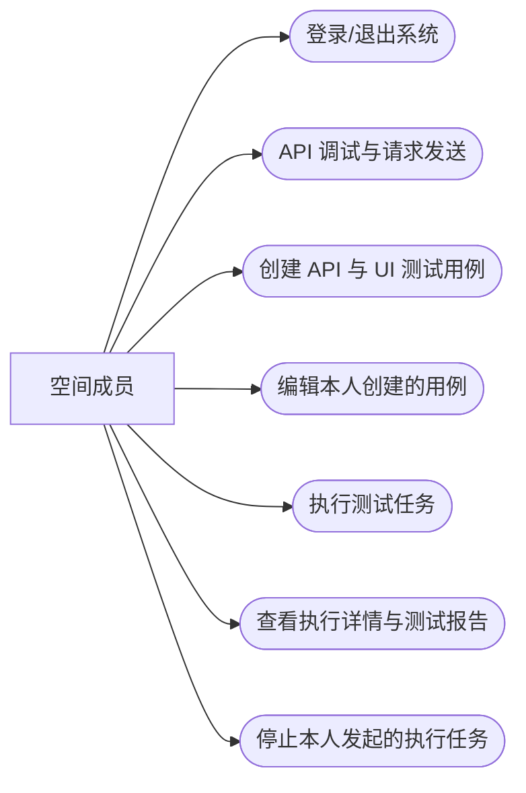

图 3-1　空间成员用例图

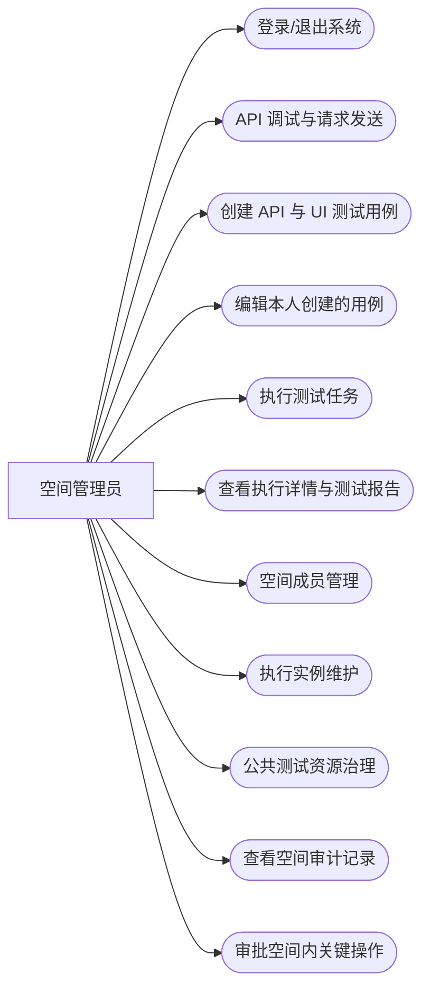

图 3-2　空间管理员用例图

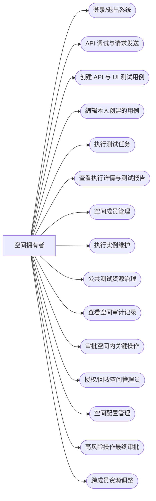

图 3-3　空间拥有者用例图

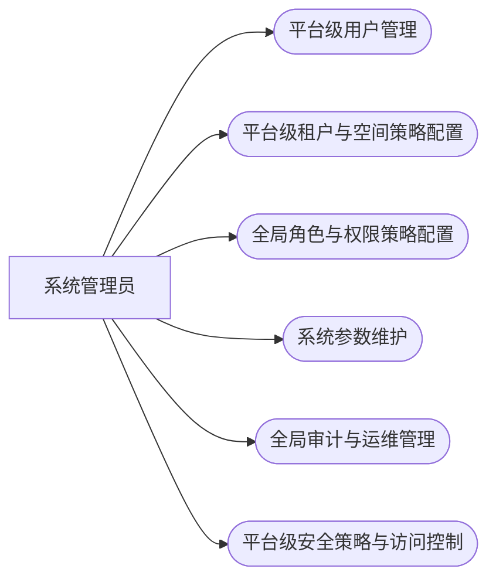

图 3-4　系统管理员用例图

与空间成员基础用例相对应的运行界面可如图 3-5～图 3-7 所示，便于在需求章节形成图文互证。

图 3-5　系统登录界面示意

注：体现用户进入系统前的认证入口，与第 5 章图 5-21 可为同一张截图，定稿时避免重复编号或在一处注明“见某图”。

图 3-6　UI 测试用例编排主界面示意

注：建议包含三栏布局及至少一条步骤，支撑“创建用例、配置步骤”等用例描述。

图 3-7　UI 测试执行结果查看界面示意

注：可为执行结果弹窗或含步骤状态、日志的视图，支撑“查看执行详情与报告”等需求表述。

## 3.2 功能需求分析
### 3.2.1 API 测试管理功能需求
API 测试管理模块主要用于对后端接口进行功能验证和回归测试，需满足以下功能需求：
- API 用例管理：支持创建、编辑、删除和查看 API 测试用例；用例应包括接口基本信息（URL、请求方法、协议）、请求头、请求参数、请求体等配置；
- 多环境支持：支持配置多个测试环境（如开发、测试、预生产），用例可在不同环境下复用，环境切换应尽量透明；
- 参数化与数据驱动：支持为用例配置变量与参数化数据，实现同一用例在不同数据组合下多次执行；
- 断言与校验：提供多种断言方式，如响应状态码、响应时间、响应体字段值、JSON 结构等，以便对接口返回结果进行自动校验；
- 接口调试与快速执行：提供接口调试界面，支持单次执行、查看请求与响应报文，并根据调试结果快速生成或调整测试用例；
- 用例组织与批量执行：支持将用例按项目、模块或标签进行分类管理，支持批量选择用例执行或按照测试计划执行。

结合 API 需求颗粒度，空间成员与空间管理员在 API 测试场景下的主要用例可分别对应图 3-1、图 3-2。

接口调试与请求展示相关需求可由实际界面佐证，如图 3-8 所示。

图 3-8　API 接口调试界面（请求区与响应区）

注：与第 5 章图 5-5 可为同一张截图；若两章均收录，建议后文用“见图 3-8”互见，避免同一图片占用两个图号。

### 3.2.2 UI 测试管理功能需求
UI 测试管理模块主要负责 Web 前端界面的自动化测试，需实现如下功能：
- UI 用例与步骤管理：支持创建 UI 测试用例，并为每个用例配置由多个步骤组成的执行流程，如打开页面、元素定位与操作、等待、断言等；
- 元素定位方式管理：支持多种元素定位方式，如 ID、Name、CSS Selector、XPath、文本内容以及基于图像的定位方式等；为 AI 视觉辅助测试提供扩展入口；
- 浏览器与执行环境配置：允许用户选择不同浏览器类型，配置浏览器启动参数及执行超时时间；
- 执行结果记录：每次执行 UI 用例时，应记录执行步骤、结果状态、错误信息及关键信息截图，以便回溯与问题定位；
- 用例复用与维护：支持公共步骤或公共页面对象的抽取，实现步骤复用和集中维护。

结合 UI 需求颗粒度，空间拥有者与系统管理员在 UI 测试治理与平台支撑场景下的主要用例可分别对应图 3-3、图 3-4。

### 3.2.3 可视化步骤编排功能需求
可视化步骤编排模块主要面向复杂业务流程测试场景，通过图形化方式组织测试步骤或用例，主要需求包括：
- 图形化流程建模：通过拖拽动作构建测试流程节点，并定义执行顺序；
- 节点属性配置：每个节点可关联已有 API 或 UI 测试用例，支持配置超时、失败重试策略；
- 流程参数与变量传递：支持流程变量、上下文变量与节点间数据传递；
- 流程调试与单步执行：支持单步执行定位问题；
- 流程版本管理：支持历史版本查看与必要回滚。

### 3.2.4 AI 视觉辅助测试功能需求
AI 视觉辅助测试模块为 UI 测试提供视觉识别能力，主要需求包括：
- 图像元素识别：支持上传目标元素图像并在执行时定位；
- 视觉断言：支持页面区域截图比对；
- 与传统定位方式结合：DOM 定位不稳定时可切换或兜底；
- 识别结果可视化：在执行报告中展示识别位置与匹配结果。

### 3.2.5 测试报告管理功能需求
测试报告管理模块主要面向测试结果归档、展示与统计分析，需求包括：
- 执行结果汇总展示：展示成功、失败、跳过统计及详细步骤日志；
- 历史记录与查询：按项目、时间、状态筛选执行历史；
- 统计报表与可视化：展示通过率、失败趋势等指标；
- 报告导出与共享：支持导出或共享报告。

### 3.2.6 用户与权限管理功能需求
为保证系统安全性和多用户协作能力，用户与权限管理模块需实现以下功能：
- 用户注册与登录；
- 角色与权限控制（空间成员、空间管理员、空间拥有者、系统管理员）；
- 审计日志记录；
- 会话管理与安全防护。

在 ToB 场景下，权限控制采用“空间级 RBAC + 资源归属约束”策略，具体要求如下：
- 空间成员默认可用：企业员工加入空间后自动拥有基础使用权限（创建用例、执行测试、查看报告）；
- 资源归属限制：空间成员仅可修改自己创建的用例，不可删除或移动他人创建的用例；
- 公共资源保护：删除、移动、批量变更公共用例等高风险操作需空间管理员及以上权限；
- 角色授权链路：空间管理员由空间拥有者授权与回收，避免管理员权限失控；
- 关键操作审计：角色变更、资源删除、权限变更等操作必须记录审计日志，支持追溯；
- 平台隔离管理：系统管理员负责平台级配置，不直接参与单个空间业务资源的日常编辑。

空间成员在 UI 测试场景下的典型操作界面如图 3-9、图 3-10 所示。

图 3-9　UI 测试编排三栏界面（动作面板、步骤列表、步骤表单）

注：与图 3-6、第 5 章图 5-7、图 5-13 描述同一页面时，任选其一编号出图，其余处写“参见图 x-x”。

图 3-10　执行实例选择与执行结果弹窗界面示意

注：可拆为两张图分别编号，也可合并为一张宽图并在图注中分述左右内容；与第 5 章图 5-8、图 5-9 可互见。

## 3.3 非功能需求分析
除上述功能需求外，系统在非功能性方面也有一定要求：
- 性能需求：在典型使用场景下，普通查询和操作响应时间控制在 1-3 秒以内，批量执行时具备基础并发处理能力；
- 可用性与易用性：界面简洁、操作路径清晰、关键操作具备提示与确认机制；
- 可扩展性：架构预留扩展点，便于后续接入更多测试类型与 AI 能力；
- 安全性：提供身份认证、权限控制与关键数据保护能力；
- 可靠性与可维护性：异常可追踪、日志可定位、模块边界清晰，便于持续演进。

上述用例图从需求层面明确了各角色的系统边界与功能职责，也为第 4 章系统设计中的模块划分、时序设计与数据库设计提供了依据。
# 第4章 系统设计
本章在需求分析的基础上，阐述系统的总体架构、功能结构、关键业务流程的时序设计以及数据库逻辑结构。用例分析见第 3 章；本章从设计视角给出体系结构、模块职责、交互时序及数据模型，为第 5 章的实现说明提供依据。

## 4.1 体系架构设计
### 4.1.1 总体架构与分层
本系统采用 B/S 架构与前后端分离模式：浏览器中的 Vue 单页应用作为表示层，Spring Boot 应用作为业务与资源层，MySQL 作为持久层；UI 自动化由后端内嵌的执行引擎通过 WebDriver 驱动本机或远程浏览器。执行过程中产生的截图等二进制文件落在服务端文件系统（可演进为对象存储），路径写入数据库便于报告展示。

表示层负责路由、表单与可视化编排界面，通过 HTTPS 调用统一前缀的 REST API；业务层封装认证、用例管理、执行调度、API 代理转发、步骤派发与异常处理；持久层以关系型表存储用户、用例与执行轨迹。分层有利于替换前端技术栈、独立扩容执行节点或拆分微服务而不牵动全局。

系统总体分层与主要技术组件如图 4-1 所示。

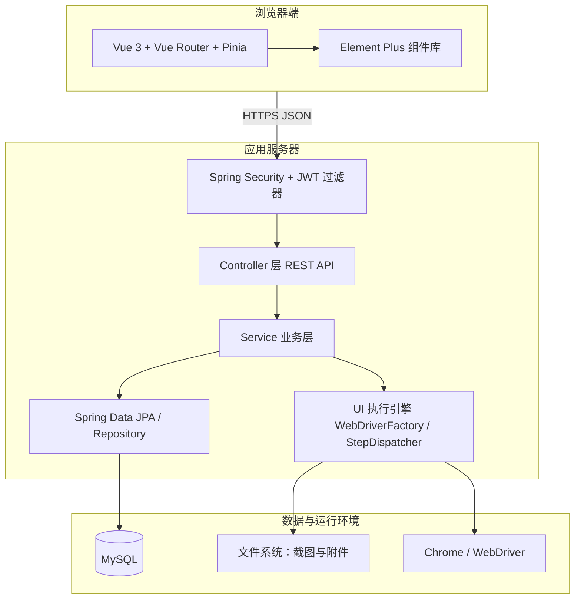

图 4-1　系统总体分层架构示意图

### 4.1.2 逻辑子系统划分
在逻辑结构上，平台划分为六个协作子系统，各子系统通过领域服务与 REST 接口交互，遵循高内聚、低耦合原则。

（1）**用户与认证子系统**：注册、登录、JWT 签发与校验、与 Spring Security 集成；后续与空间级 RBAC 结合时可扩展角色与授权。

（2）**API 测试子系统**：接口调试代理、（规划中的）用例库与环境变量管理、批量执行与断言；当前工程已实现后端 HTTP 代理以避免浏览器跨域限制。

（3）**UI 测试子系统**：UI 用例 CRUD、步骤 JSON 持久化、执行实例（本地/远程）配置、异步执行与状态查询。

（4）**可视化编排子系统**：前端以步骤列表与属性面板呈现线性编排；（规划中的）流程画布以有向图描述多用例组合与条件分支。

（5）**AI 视觉辅助子系统**：作为步骤处理器挂接到执行引擎，对截图与模板进行匹配或调用外部识别服务（当前代码为可插拔占位实现）。

（6）**报告与审计子系统**：以一次 `UiTestExecution` 为报告主键，聚合 `UiExecutionStep` 步骤轨迹；扩展阶段可增加统计表与审计日志表。

### 4.1.3 网络与部署结构
前端静态资源可由 Nginx 托管，API 请求反向代理至 Spring Boot；数据库仅内网对应用开放。若引入 Selenium Grid，执行节点与 Hub 处于同一可信网络，由应用服务器根据 `UiExecutionInstance.remoteUrl` 创建 RemoteWebDriver。单机开发环境下，前端 Vite 将 `/api` 代理到本机 8080 端口即可闭环调试。

## 4.2 系统功能结构设计
### 4.2.1 功能结构图
从功能视角，系统在顶层划分为六大模块，各模块下再细分为子功能，形成树形功能结构，如图 4-2 所示。该结构与第 3 章各角色用例分析相一致；图中对子功能标注“已实现”或“规划”，与 4.2.2 节模块职责及系统实现进度相对应。

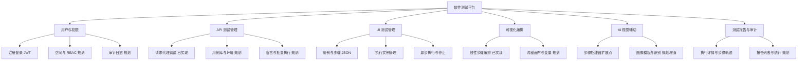

图 4-2　系统功能结构图

### 4.2.2 模块职责说明

各功能模块在系统中的职责边界、主要对外接口及数据落库形态如表 4-1 所示。表中“规划”表示该能力或对应持久化结构尚未在现行版本中全部实现，其逻辑设计见 4.3 节时序描述及 4.4.3 节扩展表。

| 模块 | 核心职责 | 主要接口与数据形态 |
|------|----------|-------------------|
| 用户与权限 | 身份认证、令牌校验；扩展阶段支持基于角色的授权 | 认证接口 `/api/auth/**`、安全过滤器；扩展阶段对应 RBAC 相关表（见表 4-8～表 4-11） |
| API 测试管理 | 请求代理调试；扩展阶段支持用例库与环境管理 | `POST /api/api-test/send`；扩展阶段对应表 4-12、表 4-13 |
| UI 测试管理 | 用例与步骤持久化、执行实例配置、异步执行与状态查询 | `/api/ui-test/test-cases`、`/instances`、`/executions`；表 4-3～表 4-6 |
| 可视化编排 | 线性步骤编排；扩展阶段支持流程图持久化 | 前端编排与 `steps_json` 字段；扩展阶段对应表 4-14 |
| AI 视觉辅助 | 在执行流水线中插入视觉类步骤 | `StepHandler` 扩展点及 `ai` 类型步骤；可选模板信息嵌入步骤 JSON |
| 测试报告与审计 | 执行过程与步骤轨迹查询；扩展阶段支持汇总报表与审计 | `GET /api/ui-test/executions/{id}` 及表 4-5、表 4-6；扩展阶段对应表 4-15 等 |

表 4-1　功能模块与职责说明

### 4.2.3 模块间依赖关系

在扩展实现后，API 用例与 UI 用例均可作为可视化流程节点的执行单元；当前版本中，UI 执行引擎依赖 `ui_test_case` 与 `ui_execution_instance` 中的配置数据，执行结果写入 `ui_test_execution` 与 `ui_execution_step`，供报告查询使用。各业务接口均经安全过滤器完成认证。AI 视觉步骤若未单独建表存储模板，可将模板路径或参数写入步骤 JSON，由对应 `StepHandler` 解析使用。

## 4.3 核心业务流程与时序设计
### 4.3.1 用户登录与受控资源访问
用户登录成功后，服务端签发 JWT；后续请求在 HTTP 头 `Authorization: Bearer` 中携带令牌，由过滤器校验签名与有效期并建立安全上下文。该交互过程与现行实现中的认证控制器及 JWT 过滤器行为一致，其时序关系如图 4-3 所示。

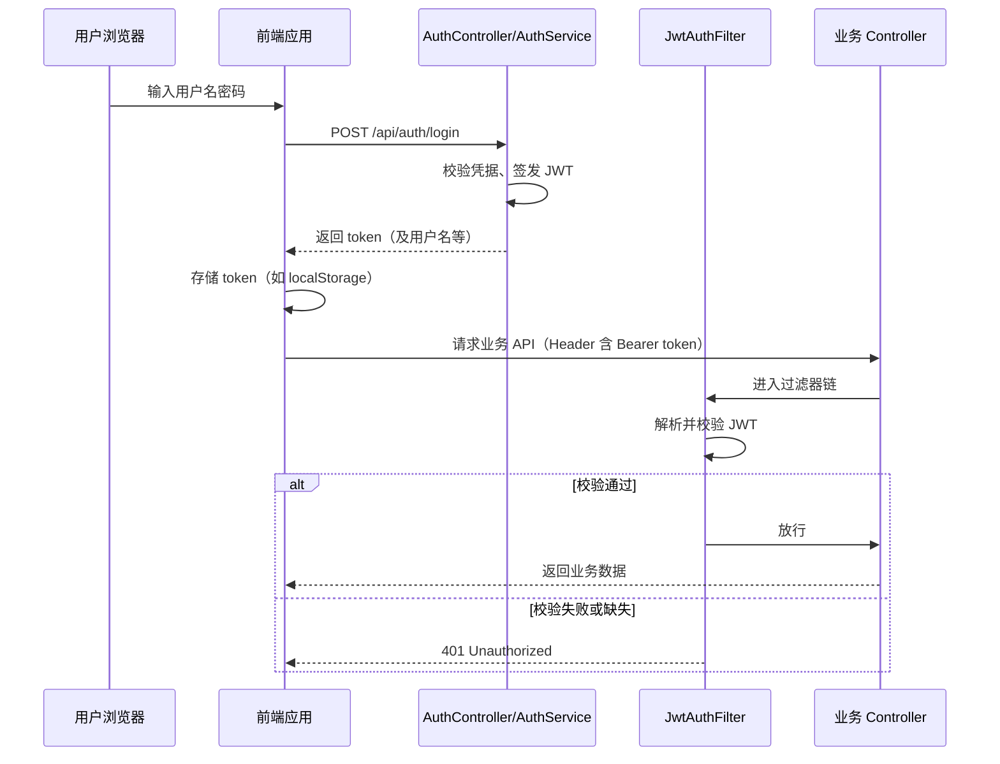

图 4-3　用户登录与 JWT 访问受控资源时序图

### 4.3.2 UI 测试用例执行
一次 UI 测试执行需校验执行实例可用，将执行主记录置为 `PENDING` 后异步启动引擎，前端通过轮询获取执行详情直至进入终态。执行引擎加载用例步骤 JSON、创建 WebDriver、按序经步骤调度器派发各步，并将结果写入 `ui_execution_step`，结束时更新执行状态并释放浏览器。上述消息传递顺序如图 4-4 所示。

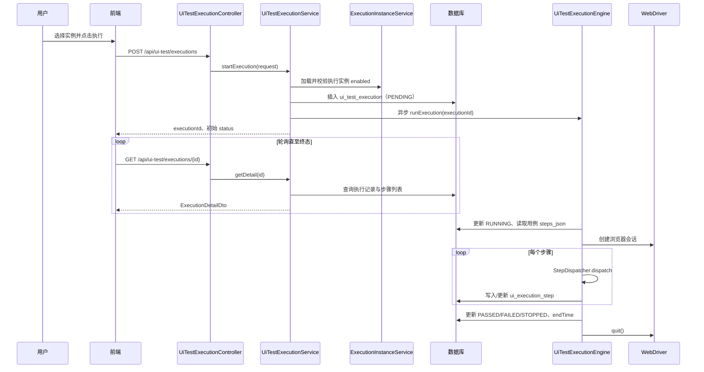

图 4-4　UI 测试用例执行时序图

### 4.3.3 API 调试代理请求
API 调试功能由后端使用 `HttpClient` 转发 HTTP 请求，以避免浏览器直连目标地址时的跨域限制；服务端在校验 URL 非空后组装请求方法、首部与正文，并将响应状态码、首部、正文与耗时返回前端。该代理调用的时序关系如图 4-5 所示。

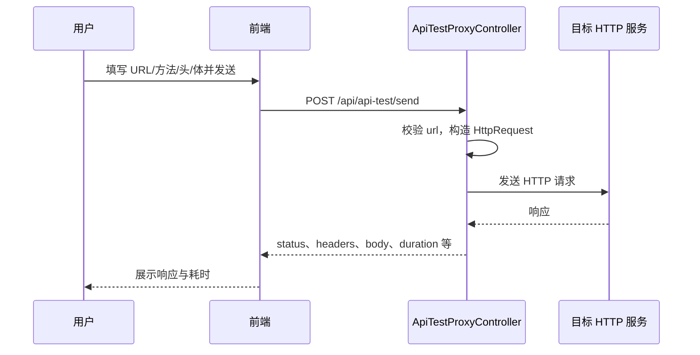

图 4-5　API 调试代理请求时序图

## 4.4 数据库设计
### 4.4.1 概念结构与 E-R 图

概念模型中，用户信息与 UI 测试用例分别独立存储；为降低读写复杂度，用例与其步骤定义合并在同一逻辑实体中，以 JSON 字段持久化。执行实例描述浏览器运行环境；一次 UI 测试执行关联一条用例与一个执行实例，并产生多条执行步骤记录。与第 3 章空间化权限模型相对应的空间、角色、API 用例、流程定义等实体在逻辑上进一步扩展，其字段设计见 4.4.3 节。已实现部分实体及其联系如图 4-6 所示。

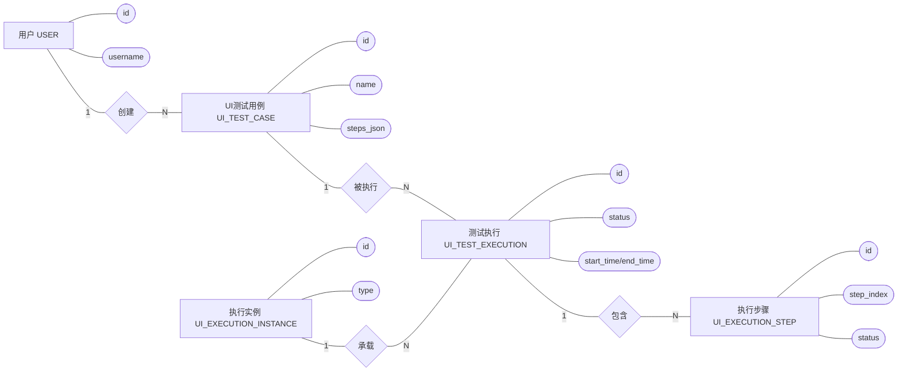

图 4-6　核心实体 E-R 图

注：图中用户与 UI 测试用例之间的联系表示需求层面的归属关系；现行实现尚未以数据库外键约束落实，可在引入空间与资源归属字段后通过外键或应用层校验统一约束。

### 4.4.2 已实现表结构

表 4-2～表 4-6 所列字段与当前 Spring Boot 工程中 Spring Data JPA 实体定义一致，类型按 MySQL 语义表述。

| 字段名 | 类型 | 约束 | 说明 |
|--------|------|------|------|
| id | BIGINT | 主键，自增 | 用户 ID |
| username | VARCHAR(64) | 非空，唯一 | 登录名 |
| password_encrypted | VARCHAR(128) | 非空 | 加密后密码 |
| created_at | TIMESTAMP | 非空，不可更新 | 创建时间 |

表 4-2　`user` 表（用户表）

表 4-3　`ui_test_case` 表（UI 测试用例表）

| 字段名 | 类型 | 约束 | 说明 |
|--------|------|------|------|
| id | BIGINT | 主键，自增 | 用例 ID |
| name | VARCHAR(128) | 非空 | 用例名称 |
| description | TEXT | 可空 | 描述 |
| steps_json | LONGTEXT | 可空 | 步骤列表 JSON，对应前端编排 |
| created_at | TIMESTAMP | 非空 | 创建时间 |
| updated_at | TIMESTAMP | 非空 | 最后更新时间 |

表 4-4　`ui_execution_instance` 表（执行实例表）

| 字段名 | 类型 | 约束 | 说明 |
|--------|------|------|------|
| id | BIGINT | 主键，自增 | 实例 ID |
| name | VARCHAR(64) | 非空 | 实例显示名 |
| type | VARCHAR(32) | 非空 | LOCAL / REMOTE 等 |
| remote_url | VARCHAR(255) | 可空 | 远程 Grid 地址 |
| config_json | TEXT | 可空 | 浏览器能力等扩展配置 JSON |
| enabled | TINYINT(1) | 非空，默认 1 | 是否启用 |
| created_at | TIMESTAMP | 非空 | 创建时间 |
| updated_at | TIMESTAMP | 非空 | 更新时间 |

表 4-5　`ui_test_execution` 表（UI 执行主记录表）

| 字段名 | 类型 | 约束 | 说明 |
|--------|------|------|------|
| id | BIGINT | 主键，自增 | 执行记录 ID |
| test_case_id | BIGINT | 非空 | 外键逻辑关联 ui_test_case.id |
| instance_id | BIGINT | 非空 | 外键逻辑关联 ui_execution_instance.id |
| status | VARCHAR(32) | 非空 | PENDING/RUNNING/PASSED/FAILED/STOPPED |
| options_json | TEXT | 可空 | headless、失败是否停等选项 JSON |
| start_time | TIMESTAMP | 可空 | 开始时间 |
| end_time | TIMESTAMP | 可空 | 结束时间 |
| error_message | TEXT | 可空 | 顶层错误信息 |
| stop_requested | TINYINT(1) | 非空，默认 0 | 用户是否请求停止 |
| created_at | TIMESTAMP | 非空 | 创建时间 |
| updated_at | TIMESTAMP | 非空 | 更新时间 |

表 4-6　`ui_execution_step` 表（UI 执行步骤明细表）

| 字段名 | 类型 | 约束 | 说明 |
|--------|------|------|------|
| id | BIGINT | 主键，自增 | 步骤记录 ID |
| execution_id | BIGINT | 非空 | 归属某次执行 |
| step_index | INT | 非空 | 从 0 起的序号 |
| step_type | VARCHAR(32) | 可空 | 如 browser、element、ai |
| action | VARCHAR(64) | 可空 | 如 openPage、click |
| status | VARCHAR(32) | 非空 | PENDING/RUNNING/PASSED/FAILED/SKIPPED |
| start_time | TIMESTAMP | 可空 | 步骤开始时间 |
| end_time | TIMESTAMP | 可空 | 步骤结束时间 |
| error_message | TEXT | 可空 | 步骤级错误 |
| screenshot_path | VARCHAR(255) | 可空 | 失败截图相对或绝对路径 |
| log_text | LONGTEXT | 可空 | 日志与摘要 |
| raw_step_json | LONGTEXT | 可空 | 原始步骤定义快照 |

为提高按用例、实例与执行记录查询的性能，可在 `test_case_id`、`instance_id`、`execution_id` 等字段上建立索引；步骤明细表可对 `(execution_id, step_index)` 建立联合索引。

### 4.4.3 规划扩展表结构

下列数据表对应第 3 章空间化权限与 API/流程等扩展需求，作为目标数据模型的逻辑设计；现行代码仓库中尚未全部建表实现，字段命名与上文保持一致（蛇形命名）。

表 4-7　`workspace` 表（空间表）

| 字段名 | 类型 | 约束 | 说明 |
|--------|------|------|------|
| id | BIGINT | PK | 空间 ID |
| name | VARCHAR(128) | 非空 | 空间名称 |
| owner_user_id | BIGINT | 非空 | 空间拥有者 |
| created_at | TIMESTAMP | 非空 | 创建时间 |

表 4-8　`role` 表（角色表）

| 字段名 | 类型 | 约束 | 说明 |
|--------|------|------|------|
| id | BIGINT | PK | 角色 ID |
| code | VARCHAR(64) | 唯一 | 如 MEMBER、WS_ADMIN、WS_OWNER、SYS_ADMIN |
| name | VARCHAR(128) | 非空 | 展示名 |
| scope | VARCHAR(32) | 非空 | PLATFORM 或 WORKSPACE |

表 4-9　`permission` 表（权限表）

| 字段名 | 类型 | 约束 | 说明 |
|--------|------|------|------|
| id | BIGINT | PK | 权限 ID |
| code | VARCHAR(128) | 唯一 | 如 case:delete:any |
| name | VARCHAR(128) | 非空 | 说明 |

表 4-10　`user_role` 表（用户—角色关联表）

| 字段名 | 类型 | 约束 | 说明 |
|--------|------|------|------|
| user_id | BIGINT | PK 联合 | 用户 |
| role_id | BIGINT | PK 联合 | 角色 |
| workspace_id | BIGINT | 可空 | 空间级角色时非空 |

表 4-11　`role_permission` 表（角色—权限关联表）

| 字段名 | 类型 | 约束 | 说明 |
|--------|------|------|------|
| role_id | BIGINT | PK 联合 | 角色 |
| permission_id | BIGINT | PK 联合 | 权限 |

表 4-12　`api_test_case` 表（API 测试用例表，规划）

| 字段名 | 类型 | 约束 | 说明 |
|--------|------|------|------|
| id | BIGINT | PK | 用例 ID |
| workspace_id | BIGINT | 可空 | 归属空间 |
| name | VARCHAR(128) | 非空 | 用例名 |
| http_method | VARCHAR(16) | 非空 | GET/POST/... |
| url_template | VARCHAR(2048) | 非空 | 支持变量占位 |
| headers_json | TEXT | 可空 | 请求头 JSON |
| body_template | LONGTEXT | 可空 | 请求体模板 |
| assertions_json | TEXT | 可空 | 断言规则 JSON |
| creator_user_id | BIGINT | 可空 | 创建人 |
| created_at | TIMESTAMP | 非空 | 创建时间 |
| updated_at | TIMESTAMP | 非空 | 更新时间 |

表 4-13　`api_environment` 表（API 环境表，规划）

| 字段名 | 类型 | 约束 | 说明 |
|--------|------|------|------|
| id | BIGINT | PK | 环境 ID |
| workspace_id | BIGINT | 非空 | 归属空间 |
| name | VARCHAR(64) | 非空 | 如 dev/test |
| base_url | VARCHAR(512) | 非空 | 基地址 |
| variables_json | TEXT | 可空 | 环境变量 JSON |

表 4-14　`flow_definition` 表（可视化流程定义表，规划）

| 字段名 | 类型 | 约束 | 说明 |
|--------|------|------|------|
| id | BIGINT | PK | 流程 ID |
| workspace_id | BIGINT | 可空 | 归属空间 |
| name | VARCHAR(128) | 非空 | 流程名称 |
| graph_json | LONGTEXT | 非空 | 节点与边、版本 |
| created_at | TIMESTAMP | 非空 | 创建时间 |
| updated_at | TIMESTAMP | 非空 | 更新时间 |

表 4-15　`audit_log` 表（审计日志表，规划）

| 字段名 | 类型 | 约束 | 说明 |
|--------|------|------|------|
| id | BIGINT | PK | 日志 ID |
| user_id | BIGINT | 可空 | 操作人 |
| action | VARCHAR(64) | 非空 | 操作类型编码 |
| resource_type | VARCHAR(64) | 可空 | 资源类型 |
| resource_id | VARCHAR(64) | 可空 | 资源主键 |
| detail_json | TEXT | 可空 | 详情 |
| created_at | TIMESTAMP | 非空 | 操作时间 |

上述扩展表与图 4-6 所示核心实体共同构成目标数据模型：空间与测试资源形成一对多联系，用户通过 `user_role` 与空间内角色绑定；API 与 UI 执行结果在空间维度聚合后，可为统计报表与审计提供数据支撑。具体建表与迁移可在后续迭代中分阶段实施。

## 4.5 本章小结

本章给出了系统分层架构、功能结构、模块职责归纳（表 4-1）以及用户登录鉴权、UI 测试执行、API 调试代理三类时序设计（图 4-3～图 4-5）；数据库部分给出了核心实体 E-R 图（图 4-6）、与现行实现一致的五个数据表（表 4-2～表 4-6）及九个规划扩展表（表 4-7～表 4-15）的字段定义。第 5 章在此基础上阐述各模块的实现要点，与本章设计内容相互对照，图表不再重复列示。
# 第5章 系统实现

本章在前文系统设计的基础上，说明各功能模块在工程中的实现要点。为降低正文与开源代码的重复、便于答辩时突出“做了什么、数据如何流转”，**本章以流程图与文字描述为主**；具体类名、方法与实现细节以仓库源码为准。**图 5-1～图 5-21 按正文出现顺序连续编号**，流程示意与界面截图穿插排列，不再单独预留“截图专用大号段”（避免出现图 5-2 之后直接跳到图 5-12 的阅读断裂）。需要插入运行截图处，在正文引用后给出**图题**；必要时另起一行**注**作为图注，说明截图内容、互见关系与排版要求。定稿时在图题下方（或按学校模板在图题上方）插入实际运行截图。

系统仍采用前后端分离：前端 Vue 3 + Element Plus，后端 Spring Boot + Spring Security（JWT），UI 执行依赖 Selenium WebDriver。

## 5.1 API 测试管理模块实现

### 5.1.1 模块结构与功能概述

API 测试管理模块承担接口调试及后续用例库扩展。当前版本已实现**统一 HTTP 请求封装**与**后端代理转发**（`POST /api/api-test/send`），避免浏览器直连第三方接口时的跨域限制；用例持久化、环境与断言等能力按第 4 章表 4-12、表 4-13 规划迭代。

前端入口为 `ApiTestView.vue` 及 `apiTest` 相关组件，经 `request` 实例访问 `/api`；后端由 `ApiTestProxyController` 使用 `HttpClient` 组装并转发请求。模块分层关系如图 5-1 所示。

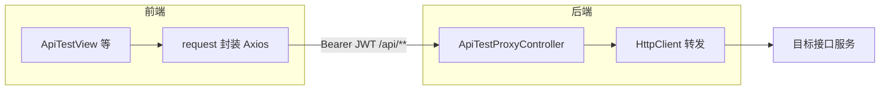

图 5-1　API 测试模块分层结构示意图

### 5.1.2 前端请求封装与鉴权处理

`request.js` 对 Axios 进行实例化：配置 `baseURL='/api'`、超时与 JSON 头；**请求拦截器**从本地存储读取 Token 并写入 `Authorization: Bearer`；**响应拦截器**在收到 401 时清除本地凭据并跳转登录页。该过程如图 5-2 所示。

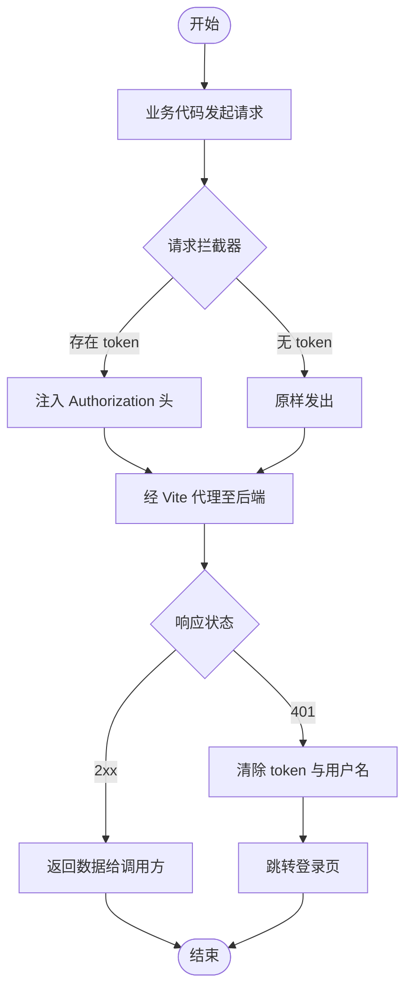

图 5-2　前端 Axios 封装与 401 处理流程

为佐证请求拦截器注入认证信息，可在浏览器开发者工具中查看发往本系统后端的请求头，运行效果如图 5-3 所示。

图 5-3　浏览器 Network 中 API 请求的 Authorization 请求头示意

注：定稿时插入截图；建议截取请求详情中的 Headers 区域，并对 Token 等敏感字段打码；请求 URL 宜体现 `/api` 前缀。

### 5.1.3 接口调试页面与代理调用

接口测试页当前可集成请求编辑器、环境选择与响应展示（与第 4 章图 4-5 时序一致：前端将 method、url、headers、body 提交给后端，后端返回 status、headers、body、duration）。完整“变量替换—断言—结果入库”流水线实现后的执行逻辑可概括为图 5-4。

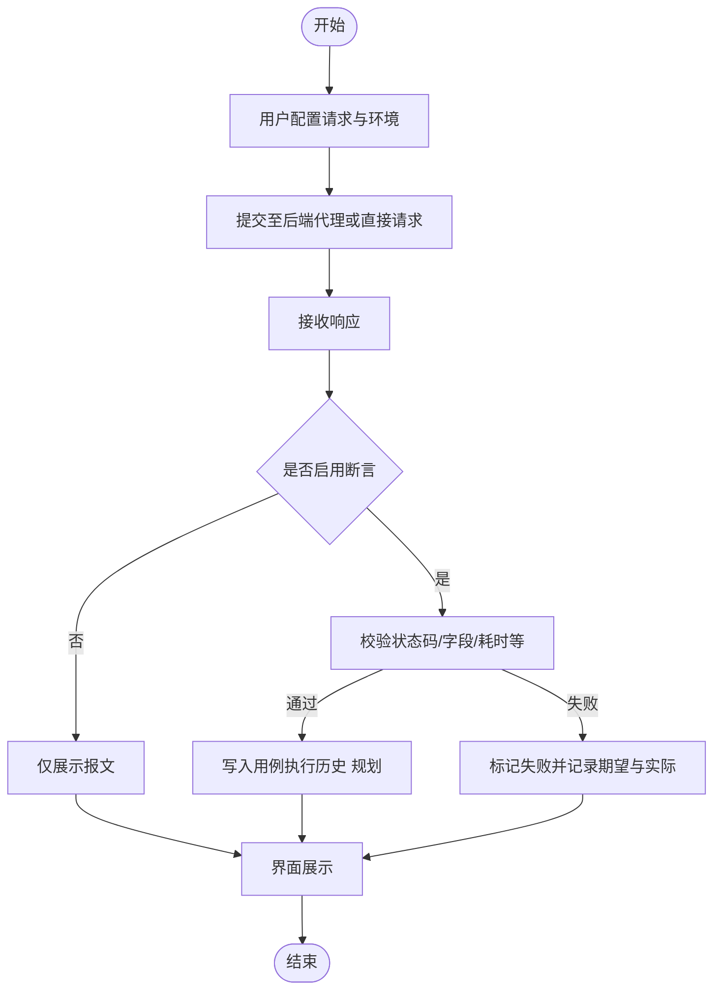

图 5-4　API 用例执行与校验目标流程（规划完整链路）

系统「接口测试」页面用于配置请求并查看代理返回结果，界面示意如图 5-5 所示。

图 5-5　接口测试页面（请求编辑区与响应展示区）

注：若当前版本仍为占位或开发中界面，可照常截图并在图注中简要说明功能迭代计划，与第 4 章图 4-5 代理时序相对应。

## 5.2 UI 测试管理模块实现

### 5.2.1 模块结构与数据建模

UI 测试管理模块包含编排界面、用例持久化、执行实例配置、异步执行与结果查询。实体关系与表结构见第 4 章图 4-6 及表 4-2～表 4-6，本节不再复述。

### 5.2.2 前端用例编排与执行触发

`UiTestView.vue` 提供用例名称与描述编辑、左侧动作面板拖拽、中间步骤列表与右侧属性表单。用户点击**保存用例**时，前端将步骤序列化为 JSON 并调用创建或更新接口；点击**执行测试**时，先校验是否已持久化得到后端用例 ID，再弹出执行实例选择对话框，调用 `POST /api/ui-test/executions` 启动任务，并**定时轮询** `GET /api/ui-test/executions/{id}` 直至终态。该交互如图 5-6 所示。

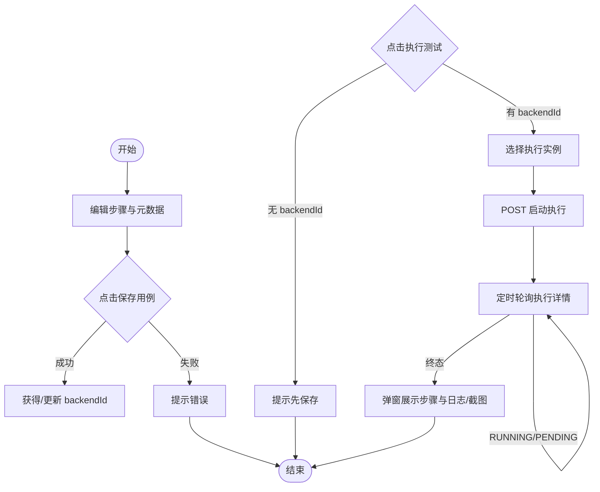

图 5-6　UI 用例保存与执行触发流程

UI 测试用例编排采用三栏布局，实际运行界面如图 5-7 所示；选择执行实例及查看执行过程时，对话框与结果弹窗如图 5-8、图 5-9 所示。

图 5-7　UI 测试编排界面（动作面板、步骤列表与步骤属性区）

注：建议图中至少包含一条已配置步骤，以便与正文“保存用例—执行”流程对应。

图 5-8　执行实例选择对话框界面示意

图 5-9　UI 测试执行结果弹窗（步骤状态与日志）

注：若存在失败步骤且前端展示截图缩略图，可一并纳入图 5-9，以增强与 `ui_execution_step` 中 `screenshot_path` 字段的对应说明。

### 5.2.3 用例持久化与控制层接口

后端 `UiTestCaseController` 映射路径前缀 `/api/ui-test/test-cases`，提供列表、详情、创建、更新、删除等 REST 接口；`UiTestCaseService` 将请求体中的步骤列表序列化为 `steps_json` 写入 `ui_test_case` 表。处理过程可概括为图 5-10。

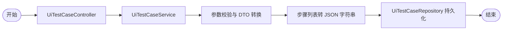

图 5-10　UI 用例持久化调用关系

### 5.2.4 执行服务与执行引擎

`UiTestExecutionService.startExecution` 校验执行实例已启用，创建 `UiTestExecution` 记录（状态 `PENDING`），持久化后**异步**调用 `UiTestExecutionEngine.runExecution`。引擎加载用例与步骤、创建 WebDriver、循环调用 `StepDispatcher` 执行每步并写入 `ui_execution_step`，根据失败策略与停止标记更新总状态，最后在 `finally` 中关闭浏览器。与第 4 章图 4-4 时序一致，引擎内部主循环如图 5-11 所示。

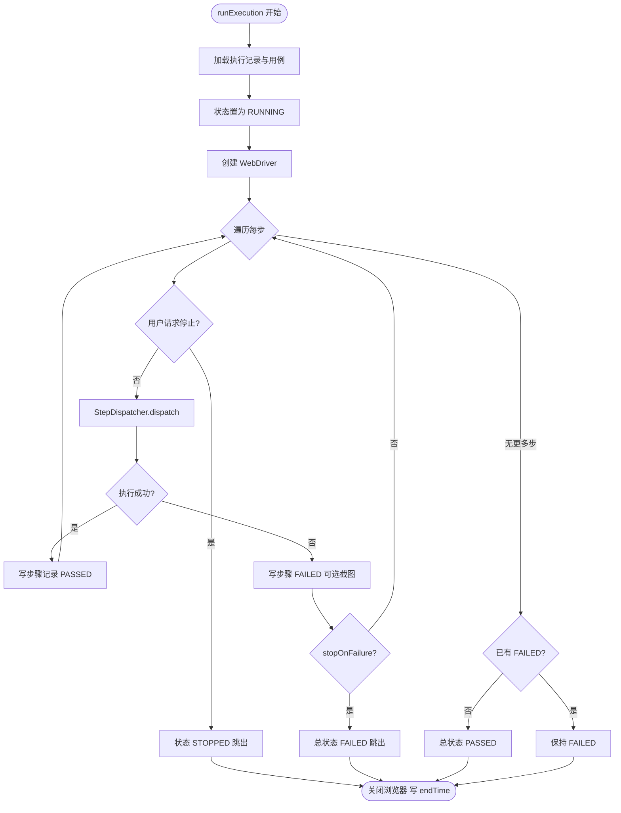

图 5-11　UI 执行引擎主循环示意

## 5.3 可视化步骤编排模块实现

当前阶段将**线性步骤列表**视为可视化编排的第一种形态：与 UI 用例界面同页完成，步骤数据结构为 `{ type, action, parameters, ... }`，与后端 `StepDefinition` 一一对应。独立“流程画布”（条件分支、子流程）可在 `flow_definition` 表落库后扩展。

### 5.3.1 界面布局与操作路径

左侧按类别展示可拖拽动作（浏览器、元素、等待、断言、AI 等），中间维护步骤顺序，右侧编辑选中步骤参数。用户操作路径为：**拖入步骤 → 选中 → 填写参数 → 保存用例**。如图 5-12 所示。

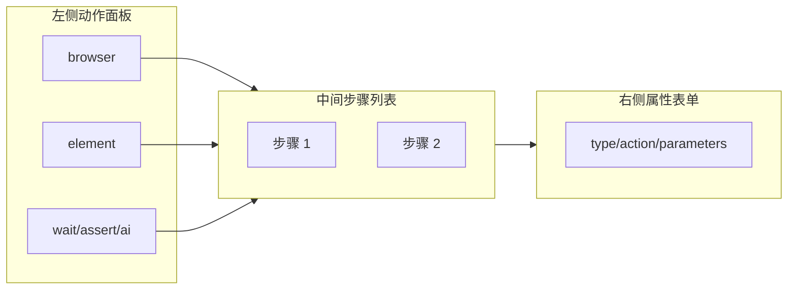

图 5-12　可视化编排三栏结构示意

与图 5-12 结构示意图对应的实际系统界面如图 5-13 所示。

图 5-13　可视化步骤编排实际界面与图 5-12 对照

注：可与图 5-7 使用同一张截图时，在图注中说明“与 5.2.2 节界面为同一页面”，避免定稿时重复贴图。

### 5.3.2 步骤定义与调度扩展

`StepDispatcher` 注入 `List<StepHandler>`，对每一步依次调用 `supports(step)`，命中则执行 `execute`。已实现处理器包括浏览器、元素、等待、断言及 AI 演示类等。扩展新步骤类型时仅需新增 `StepHandler` 实现并由 Spring 注入列表，无需修改引擎主循环。调度逻辑如图 5-14 所示。

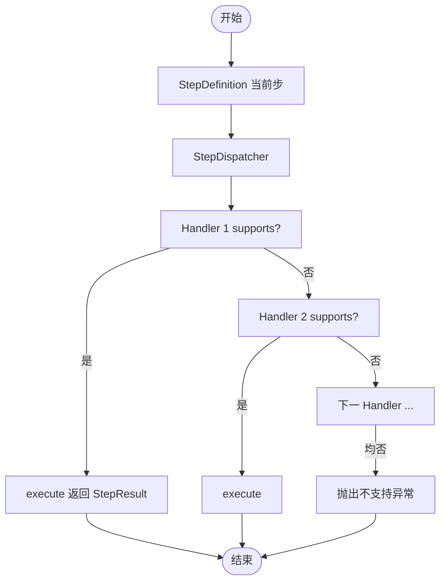

图 5-14　步骤处理器链式调度流程

## 5.4 AI 视觉辅助测试模块实现

### 5.4.1 模块位置

AI 类步骤与普通步骤共用执行流水线：`type=ai` 时由对应 `StepHandler` 处理，执行结果同样写入 `ui_execution_step`，便于在报告中统一展示。

### 5.4.2 演示实现与扩展流程

当前 `AiImageClickHandler` 等为**架构验证**向演示：校验 `type/action` 后调用 WebDriver 执行点击，日志中注明未做真实图像匹配。后续可接入截图、模板匹配或外部视觉服务，扩展流程如图 5-15 所示。

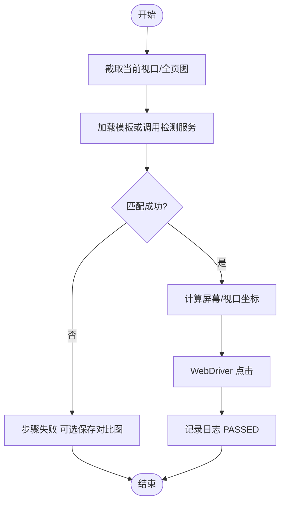

图 5-15　AI 视觉点击扩展实现参考流程

在步骤属性中将类型配置为 AI 类动作时的表单区域如图 5-16 所示。

图 5-16　AI 类步骤（如 aiImageClick）在属性面板中的配置界面

注：当前实现为演示向，图注中可说明与真实图像模板、识别服务接入的关系。

## 5.5 测试报告管理模块实现

### 5.5.1 报告数据采集

每次执行在 `ui_test_execution` 中保存总状态与时间区间，在 `ui_execution_step` 中按 `step_index` 保存每步状态、日志、失败截图路径等。`UiTestExecutionService.getDetail` 按执行 ID 查询主表与步骤表，组装为 `ExecutionDetailDto` 供前端展示。

### 5.5.2 接口与前端展示

`UiTestExecutionController` 提供启动执行、查询详情、请求停止等接口（路径 `/api/ui-test/executions`）。前端在执行结果弹窗中轮询详情接口，列表页 `ReportsView.vue` 可为报告汇总预留入口。数据流如图 5-17 所示。

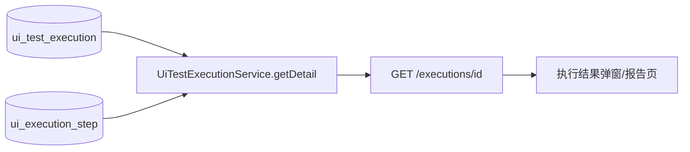

图 5-17　执行详情与报告展示数据流

执行详情与报告相关的前端呈现如图 5-18、图 5-19 所示。

图 5-18　基于执行详情数据的运行结果展示（弹窗或抽屉）

注：宜体现总状态、步骤列表及失败步骤截图入口（若有）；与 `GET /api/ui-test/executions/{id}` 返回结构对应。

图 5-19　测试报告列表页面（或功能未上线时的占位界面）

注：若为 `ReportsView` 等占位页，截图中 Empty 提示文字可保留，并在图注说明后续接入计划。

## 5.6 用户与权限管理模块实现

前文 5.1～5.5 节按出现顺序已编排至**图 5-19**（其中**图 5-11** 为 UI 执行引擎主循环，**图 5-12～图 5-19** 为可视化编排、步骤调度、AI 扩展、报告数据流及界面示意等）。**本节仅余图 5-20、图 5-21**，分别对应 JWT 认证实现流程与登录页截图，与图 5-11 之间相隔的是图 5-12～图 5-19，并非编号跳号。

### 5.6.1 认证与会话管理

登录与 JWT 校验的时序见第 4 章图 4-3。工程实现上：`AuthController` 提供注册与登录；`JwtAuthFilter` 解析 Bearer Token 并建立安全上下文；前端 `request` 拦截器负责注入 Token 与 401 跳转。整体可归纳为图 5-20。

```mermaid
flowchart TD
    ST([开始]) --> L[登录成功]
    L --> T[服务端返回 JWT]
    T --> Store[前端存储 token]
    Req[后续 API 请求] --> Inj[拦截器注入 Authorization]
    Inj --> API[后端 JWT 过滤器校验]
    API -->|合法| OK[进入业务 Controller]
    API -->|非法/过期| U401[返回 401]
    U401 --> Cl[前端清除 token 跳转登录]
    OK --> ED([结束])
    Cl --> ED
```

图 5-20　JWT 认证与 401 处理实现流程

用户登录入口界面如图 5-21 所示。

图 5-21　系统用户登录页面

注：可连同注册入口或系统标题一并截取，便于与第 4 章图 4-3 认证时序对照；勿在截图中保留真实明文密码。

### 5.6.2 权限控制与审计

安全配置中对 `/api/ui-test/**` 等路径要求认证；细粒度空间 RBAC 与审计表见第 4 章表 4-7～表 4-11、表 4-15，可在后续迭代与业务接口联动。当前关键异常由全局异常处理器统一返回，便于日志分析与问题定位。


# 第6章 系统测试
## 6.1 测试原则与环境
### 6.1.1 测试原则
本阶段测试以开发自测为主，遵循以下原则：
1)	重点覆盖核心流程：优先验证登录、UI 用例的创建与执行、执行结果查看等主流程，保证系统主路径可用。
2)	可重复执行：测试步骤与预期结果明确，便于在不同环境下重复执行并对比结果。
3)	问题可追溯：对失败用例记录操作步骤与现象，便于定位与修复。
### 6.1.2 测试环境
项目	说明
操作系统	Windows 10 / 11
后端	JDK 17，Spring Boot 2.x/3.x，Maven
前端	Node.js 18+，Vue 3，Vite，Element Plus
数据库	MySQL 8.x
浏览器	Chrome 最新版（用于前端访问及 UI 自动化执行）
后端服务默认运行于 http://localhost:8080，前端开发服务器通过 Vite 代理将 /api 转发至后端。UI 自动化执行使用本地 Chrome，由 WebDriverManager 自动管理 ChromeDriver。
## 6.2 功能测试
### 6.2.1 API 测试管理功能测试
API 测试模块当前提供请求代理接口（后端转发 HTTP 请求以避免 CORS），以及前端占位页面。以下用例验证代理发送请求与响应展示是否正常。
编号	测试项	操作步骤	预期结果	实际结果
1	代理发送 GET 请求	调用 POST /api/api-test/send，method=GET，url 为某公网 GET 接口	返回 200，body 中包含请求信息	通过
2	代理发送 POST 请求	调用 /send，method=POST，url 为 https://httpbin.org/post，body 为 JSON 字符串	返回 200，body 中包含提交的 body	通过
3	URL 为空校验	调用 /send，url 为空或未传	返回 400，提示 URL 不能为空	通过
4	请求超时或不可达	调用 /send，url 为无效或不可达地址	返回 200 但 status 为 0 或携带 error 信息	通过
### 6.2.2 UI 测试管理功能测试
UI 测试管理包括用例的增删改查、执行实例列表、发起执行、查询执行详情与停止执行。
编号	测试项	操作步骤	预期结果	实际结果
1	获取用例列表	调用 GET /api/ui-test/test-cases	返回 200，body 为数组，元素含 id、name、description	通过
2	创建 UI 用例	调用 POST /api/ui-test/test-cases，body 含 name、description、steps（至少一条，如 openPage）	返回 200，body 含新用例 id、name、steps	通过
3	更新 UI 用例	调用 PUT /api/ui-test/test-cases/{id}，修改 name 或 steps	返回 200，再次 GET 该 id 可见更新内容	通过
4	获取用例详情	调用 GET /api/ui-test/test-cases/{id}	返回 200，body 含完整 steps	通过
5	删除 UI 用例	调用 DELETE /api/ui-test/test-cases/{id}，再 GET 该 id	首次返回 204，再次 GET 返回 404 或 4xx	通过
6	获取执行实例列表	调用 GET /api/ui-test/instances	返回 200，至少包含“本地浏览器”等实例，含 id、name、type、enabled	通过
7	发起执行	调用 POST /api/ui-test/executions，body 含 testCaseId、instanceId、headless 等	返回 200，body 含 executionId、status（如 PENDING）	通过
8	查询执行详情	调用 GET /api/ui-test/executions/{id}	返回 200，含 status、steps 数组，步骤含 index、stepType、action、status、logText 等	通过
9	停止执行	调用 POST /api/ui-test/executions/{id}/stop	返回 200 或 204，随后 GET 详情可见 status 变为 STOPPED 或最终状态	通过
### 6.2.3 可视化步骤编排功能测试
可视化步骤编排与 UI 测试管理共用前端页面：左侧动作面板、中间步骤列表、右侧步骤属性。自测以“保存用例”和“执行”结果为准，步骤数据通过 UI 用例接口持久化。
编号	测试项	操作步骤	预期结果	实际结果
1	拖拽添加步骤	从左侧面板拖入“打开网页”“强制等待”等步骤到中间列表	步骤列表新增对应项，可选中后在右侧配置参数	通过
2	配置步骤参数	在右侧表单为“打开网页”步骤填写 URL（如 https://www.baidu.com）并保存	保存后再次打开用例，该步骤仍为打开网页且 URL 正确	通过
3	保存用例含多步骤	已添加至少 2 步（如打开网页 + 强制等待），点击“保存用例”	接口返回成功，GET 用例详情可见 steps 长度与顺序一致	通过
4	步骤顺序调整	在列表中上移/下移某步骤后保存	保存后 GET 详情，steps 顺序与界面一致	通过
### 6.2.4 AI 视觉辅助测试功能测试
AI 视觉辅助以“ai + aiImageClick”步骤类型集成，当前为演示实现（不执行真实图像匹配）。自测验证该类型步骤能否被正确识别与执行，且不导致执行引擎报错。
编号	测试项	操作步骤	预期结果	实际结果
1	识别 AI 图像点击步骤	创建用例含一步 type=ai、action=aiImageClick，发起执行	该步骤被 AiImageClickHandler 处理，步骤状态为 PASSED，日志含“演示实现”等提示	通过
2	AI 步骤与其它步骤组合	用例步骤为：打开网页 → aiImageClick → 强制等待，执行用例	三步按序执行，执行记录中三步均有状态与日志	通过
### 6.2.5 测试报告管理功能测试
测试报告依赖执行详情接口与前端执行结果弹窗。当前无独立“报告列表”后端接口时，自测以执行详情与弹窗展示为主。
编号	测试项	操作步骤	预期结果	实际结果
1	执行详情含步骤列表	调用 GET /api/ui-test/executions/{id}	返回 status、startTime、endTime、steps 数组，每步含 index、stepType、action、status、logText	通过
2	失败步骤含截图路径	GET 有步骤失败的执行详情	失败步骤对应的 step 含 screenshotPath	通过
3	前端执行结果弹窗	在编排页点击执行并选择实例，等待执行结束	弹窗中展示状态、步骤列表及每步状态/日志，失败步骤可展示截图（若前端已实现）	通过
### 6.2.6 用户与权限管理功能测试
用户与权限管理包括注册、登录、Token 携带与 401 处理。当前部分接口配置为 permitAll，自测仍验证登录与 Token 机制是否可用，以便后续收紧权限。
编号	测试项	操作步骤	预期结果	实际结果
1	用户注册	调用 POST /api/auth/register，body 含 username、password	返回 200 或 201，或返回明确成功信息	通过
2	用户登录	调用 POST /api/auth/login，body 含正确 username、password	返回 200，body 含 token（或 accessToken）	通过
3	错误密码登录	调用 POST /api/auth/login，password 错误	返回 401 或 4xx，不返回 token	通过
4	携带 Token 获取当前用户	请求头带 Authorization: Bearer {token}，调用 GET /api/auth/me	返回 200，body 含当前用户信息	通过
5	无 Token 访问需认证接口	不带 Authorization 调用 GET /api/auth/me	返回 401	通过
6	前端 401 跳转登录页	在已登录状态下清除 localStorage 中 token 后，触发任意需认证请求	接口返回 401 后，前端跳转至登录页或提示未登录	通过
 
# 第7章 总结与展望
## 7.1 总结
本文围绕“基于 B/S 架构的软件测试系统设计与实现”这一课题，针对传统测试工具分散、自动化程度有限、智能化不足等问题，提出并实现了一套集 API 测试管理、UI 测试管理、可视化步骤编排、AI 视觉辅助测试及测试报告管理于一体的软件测试平台。
首先，在充分调研国内外相关研究与工具的基础上，本文对系统的功能需求和非功能需求进行了系统分析，明确了系统需支持的主要功能模块和性能、安全性目标。随后，结合 Vue、Spring Boot、MySQL、Selenium 以及 AI 视觉识别等关键技术，设计了系统的总体架构、逻辑结构和数据库结构，并给出了核心模块的详细设计方案。在此基础上，本文完成了各核心模块的实现与集成，使系统能够支持测试用例的配置、执行与结果分析的闭环流程。最后，通过系统测试验证了平台在功能完整性与基本性能方面能够满足预期需求，证明了设计方案的可行性与有效性。
综上所述，本文实现的软件测试系统在一定程度上提升了测试活动的自动化程度和管理效率，为团队提供了一种可扩展的统一测试平台，也为进一步引入更多智能测试能力奠定了基础。
## 7.2 展望
尽管本文设计与实现的系统已经具备一定的实用价值，但仍存在一些不足，有待在后续工作中进一步改进和完善：
测试类型的扩展：目前系统主要支持功能性 API 测试与 Web UI 测试，未来可考虑引入性能测试、接口压测、移动端自动化测试等能力，构建更为全面的测试平台。
智能化程度提升：当前 AI 视觉模块主要用于元素识别等局部场景，后续可以探索基于自然语言自动生成测试用例、基于日志与历史数据的缺陷预测等更高层次的智能测试能力。
持续集成与 DevOps 集成：未来可以将系统与 Jenkins、GitLab CI 等持续集成工具深度集成，实现在代码提交或构建完成后自动触发测试任务，进一步融入 DevOps 流程。
可观测性与可维护性增强：可以增加更完善的监控与告警机制，对执行节点状态、任务排队情况、资源使用情况进行实时监控，为大规模部署与运维提供支持。
通过上述方向的持续探索和改进，期望将本系统逐步发展为一个功能更加完备、智能化程度更高的综合测试平台，更好地支撑软件质量保障工作。


参考文献
[1]	缪佳辉,李珺,郭云,等.基于AI技术的海关软件自动化测试平台设计与应用[J].中国口岸科学技术,2026,8(01):4-9.
[2]	韩家超.基于Python的一站式自动化测试平台设计与实现[J].大数据时代,2024,(11):43-47.
[3]	张萍.基于自动生成测试脚本的自动化测试平台研究与实现[D].北京交通大学,2023.DOI:10.26944/d.cnki.gbfju.2023.003068.
[4]	石析.API接口自动化测试平台的设计与实现[D].西安电子科技大学,2021.DOI:10.27389/d.cnki.gxadu.2021.002399.
[5]	韩露.基于Pytest的接口自动化测试系统研究[D].西安石油大学,2025.DOI:10.27400/d.cnki.gxasc.2025.000862.
[6]	沈巧玲,段伟天.自动化测试平台的设计与实现研究[J].中国无线电,2025,(12):34-37.
[7]	杨卫军,魏帅,张利茸,等.基于OCR+NLP的质量控制文本识别与处理系统设计[J].信息技术,2026,(02):28-34.DOI:10.13274/j.cnki.hdzj.2026.02.006.
[8]	马红,王通.智能OCR：文字识别小帮手[J].光明少年,2025,(11):12-13.
[9]	陈志坚,陈星.人工智能在自动化软件测试技术中的应用研究[J].智能建筑与智慧城市,2025,(S2):152-154.DOI:10.13655/j.cnki.ibci.2025.S2.046.
[10]	赵亮,王斌,张玲宁.基于自动化测试技术的Web服务优化研究[J].自动化应用,2025,66(14):256-259.DOI:10.19769/j.zdhy.2025.14.071.
[11]	杨红燕.基于AI的软件用户界面（UI）自动化测试框架设计与实现[J].软件,2025,46(12):67-69.
[12]	闫红红,周千明,薛涛.UI自动化测试关键技术应用研究[J].微型电脑应用,2025,41(07):19-23.
[13]	罗正军,金旭东,张丽丽.基于图像匹配的Web UI自动测试方法研究[J].计算机技术与发展,2022,32(10):65-69.
[14]	Nalinee S. Experimental Test and Run Using Equivalence Partitioning and Control-Limit Techniques for Mobile Software[J]. International Journal of Service Science, Management, Engineering, and Technology (IJSSMET), 2026, 17(1): 1-14. DOI: 10.4018/IJSSMET.399173.
[15]	Galle B F, Parsa S, Zakeri M. A systematic literature review on transformation for testability techniques in software systems[J]. Information and Software Technology, 2025, 185: 107788. DOI: 10.1016/j.infsof.2025.107788.
[16]	Wu H. Analysis of the Effectiveness of Artificial Intelligence Technology in Defect Prediction in Software Testing[J]. Innovative Applications of AI, 2025, 2(1): 13-16. DOI: 10.70695/IAAI202501A4.
[17]	Goyal S. Software Measurements Using Machine Learning Techniques - A Review[J]. Recent Advances in Computer Science and Communications, 2023, 16(1). DOI: 10.2174/2666255815666220407101922.