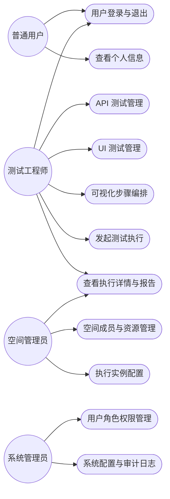

# Mermaid 渲染测试

```mermaid
flowchart LR
    U((普通用户))
    T((测试工程师))
    S((空间管理员))
    A((系统管理员))

    UC1([用户登录与退出])
    UC2([查看个人信息])
    UC3([API 测试管理])
    UC4([UI 测试管理])
    UC5([可视化步骤编排])
    UC6([发起测试执行])
    UC7([查看执行详情与报告])
    UC8([空间成员与资源管理])
    UC9([执行实例配置])
    UC10([用户角色权限管理])
    UC11([系统配置与审计日志])

    U --> UC1
    U --> UC2
    T --> UC1
    T --> UC3
    T --> UC4
    T --> UC5
    T --> UC6
    T --> UC7
    S --> UC8
    S --> UC9
    S --> UC7
    A --> UC10
    A --> UC11
```

