# 第五章 系统实现 - Mermaid 图表汇总

本文档包含论文第五章中所需的 ER 图、结构图、流程图、时序图与类图，均使用 Mermaid 语法编写。可将对应代码块复制到支持 Mermaid 的编辑器（如 Typora、VS Code 插件、或在线 [https://mermaid.live](https://mermaid.live) ）中渲染后导出为 PNG/SVG 插入论文。

**说明**：每个图下方均标注了「**插入位置**」（对应论文中哪一段落之后插入该图）和「**论文中可写说明**」（引用该图时可写的“如图x-x所示”类表述），便于直接用于正文。

**E-R 图约定**：文档中的 E-R 图采用教材常用画法——**矩形表示实体**，**菱形（或六边形）表示联系**，**连线上的 1、N 表示联系的基数**；实体的属性在正文或数据库逻辑结构中单独列出，图中不画属性框，以避免与“表结构”混淆。

### 图表与段落对应速查

| 图号 | 图名 | 建议插入段落（写在该段文字之后） |
|------|------|----------------------------------|
| 图 5-1 | API 测试模块整体结构示意图 | 5.1.1 中介绍完“为后续扩展 API 用例建模和断言逻辑打下基础”之后 |
| 图 5-2 | API 用例执行流程图 | 5.1.2/5.1.3 中介绍接口调试与执行流程的段落之后 |
| 图 5-3 | UI 用例与执行相关 E-R 图 | 5.2.1 中说明“UI 用例与执行相关实体之间的关系”时 |
| 图 5-4 | UI 用例执行时序图 | 5.2.4 末尾，执行引擎核心代码与说明之后 |
| 图 5-5 | 可视化编排界面结构示意图 | 5.3.1 中说明“前端可视化结构与后端执行模型一一对应”之后 |
| 图 5-6 | 步骤处理器类图 | 5.3.2 中介绍 StepDispatcher 与 StepHandler、说明“分发到具体处理器”时 |
| 图 5-7 | AI 视觉步骤在执行流程中的位置 | 5.4.1 中说明“以 AiImageClickHandler 形式集成到步骤处理器体系”之后 |
| 图 5-8 | AI 视觉识别流程图 | 5.4.2 中说明“可后续接入 OpenCV 或外部 AI 服务”时 |
| 图 5-9 | 执行记录与步骤记录 E-R 图 | 5.5.1 中说明“写入 UiExecutionStep、UiTestExecution”之后 |
| 图 5-10 | 报告数据流与展示结构 | 5.5.2 中介绍 getDetail 与前端弹窗、报告列表衔接时 |
| 图 5-11 | 用例执行结果统计示意 | 5.5.2 中介绍“统计报表与可视化”“通过率与失败分布”时 |
| 图 5-12 | 登录与 Token 流程时序图 | 5.6.1 中说明 Token 存储与拦截器注入之后 |
| 图 5-13 | RBAC 权限模型示意图 | 5.6.2 中说明“RBAC”及 User、Role、Permission 时 |
| 图 5-14 | 请求认证与 401 处理流程 | 5.6.1 中说明“401 时清除 Token 并跳转登录”时 |

---

## 5.1 API 测试管理模块

**插入位置**：写在「5.1.1 模块结构与功能概述」中，介绍完“当前系统已经完成接口测试模块的前端入口和网络请求封装……为后续扩展 API 用例建模和断言逻辑打下基础”之后，插入本图。

### 图 5-1 API 测试模块整体结构示意图

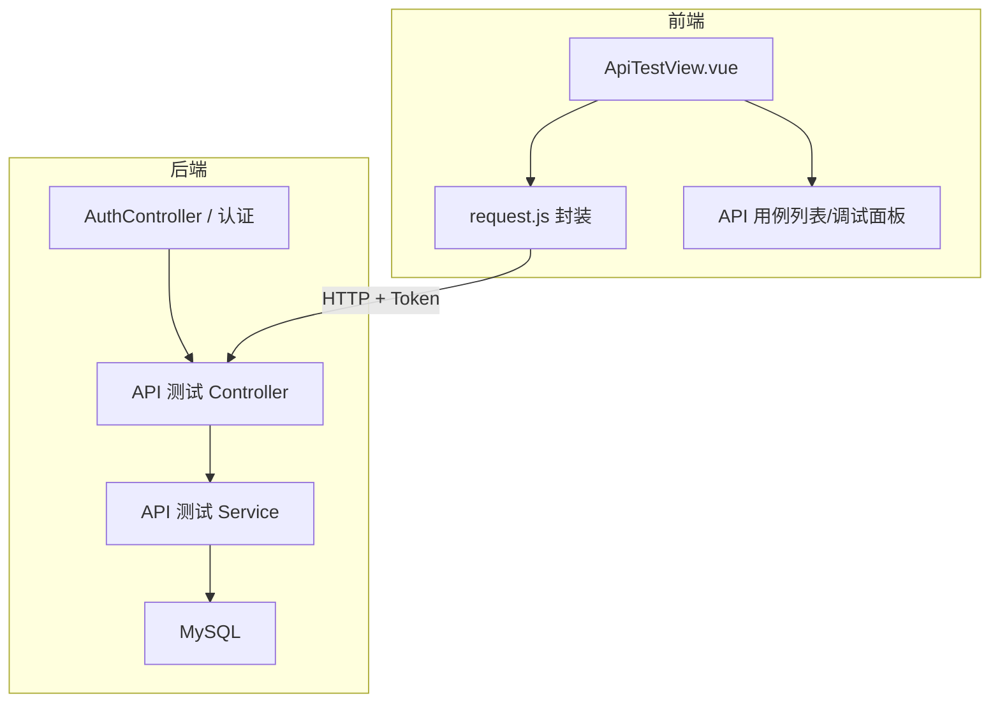

**论文中可写说明**：如图 5-1 所示，API 测试模块在整体上分为前端与后端两层：前端由 ApiTestView 与 request.js 封装组成，负责界面展示与带 Token 的 HTTP 请求；后端在认证之后由 API 测试 Controller、Service 与 MySQL 完成用例管理与持久化，前后端通过 REST 接口与统一认证进行协作。

---

**插入位置**：写在「5.1.2」或「5.1.3」中，在介绍“接口调试与执行”或“API 用例执行流程”的段落之后插入。

### 图 5-2 API 用例执行流程图

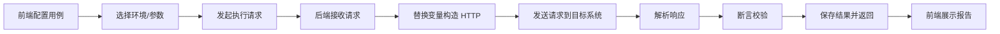

**论文中可写说明**：如图 5-2 所示，API 用例的完整执行流程为：用户在前端配置用例并选择环境与参数后发起执行请求，后端接收请求后替换变量并构造 HTTP 请求发送至目标系统，再解析响应、进行断言校验，最后将结果持久化并返回前端展示报告。

---

## 5.2 UI 测试管理模块

**插入位置**：写在「5.2.1 模块结构与数据建模」中，在介绍完“用例持久化服务”“执行服务与执行引擎”等组成后，说明“UI 用例与执行相关实体之间的关系”时插入。

### 图 5-3 UI 用例与执行相关实体关系图（E-R 概念）

采用 E-R 图常用画法：**矩形表示实体**，**菱形表示联系**，**连线上的 1、N 表示基数**。属性在正文或逻辑结构中单独说明，图中只体现实体与联系。

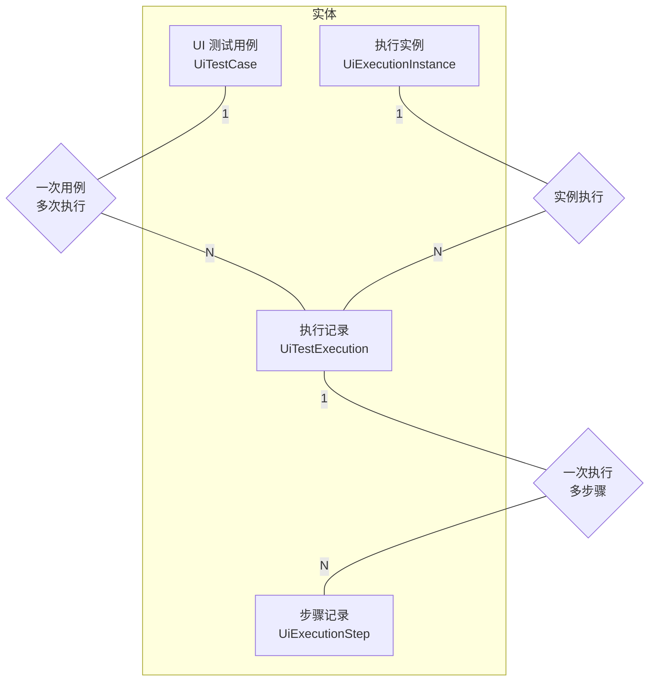

**论文中可写说明**：如图 5-3 所示，UI 测试管理模块涉及四类核心实体：UiTestCase 与 UiTestExecution 为一对多关系（一个用例可对应多次执行），UiExecutionInstance 与 UiTestExecution 为一对多关系（一个执行实例可承担多次执行），UiTestExecution 与 UiExecutionStep 为一对多关系（一次执行包含多条步骤记录），上述关系构成了用例管理、执行调度与报告查询的数据基础。

---

**插入位置**：写在「5.2.4 执行服务与执行引擎实现」末尾，在给出执行引擎核心代码并说明“执行引擎负责解析步骤并调度 Selenium 完成页面操作”之后，插入本时序图。

### 图 5-4 UI 用例执行时序图

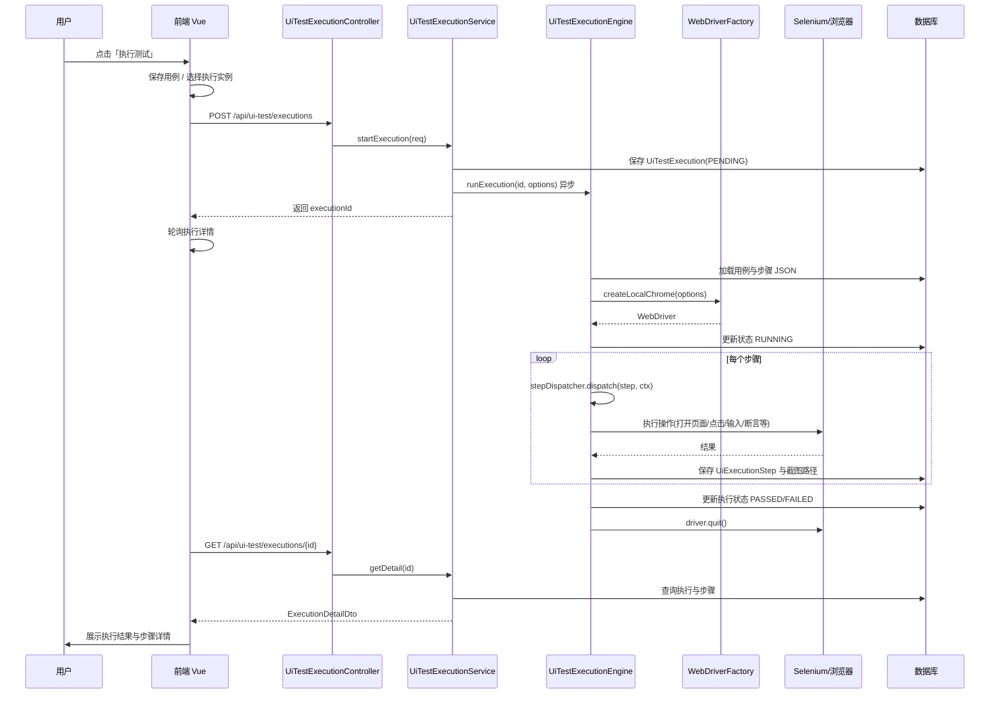

**论文中可写说明**：如图 5-4 所示，UI 用例执行的整体时序为：用户在前端点击执行测试并选择执行实例后，前端调用执行接口，执行服务先持久化 PENDING 状态的执行记录并异步启动执行引擎，随后前端通过轮询获取执行详情；执行引擎在加载用例与步骤后创建 WebDriver、按序派发步骤至 Selenium、将每步结果与截图写入数据库，结束时更新执行状态并关闭浏览器，最终前端将执行结果与步骤详情展示给用户。

---

## 5.3 可视化步骤编排模块

**插入位置**：写在「5.3.1 可视化编排总体实现思路」中，在说明“用户通过拖拽动作从左侧面板到步骤列表实现线性编排”及“前端可视化结构与后端执行模型一一对应”之后插入。

### 图 5-5 可视化编排界面结构示意图

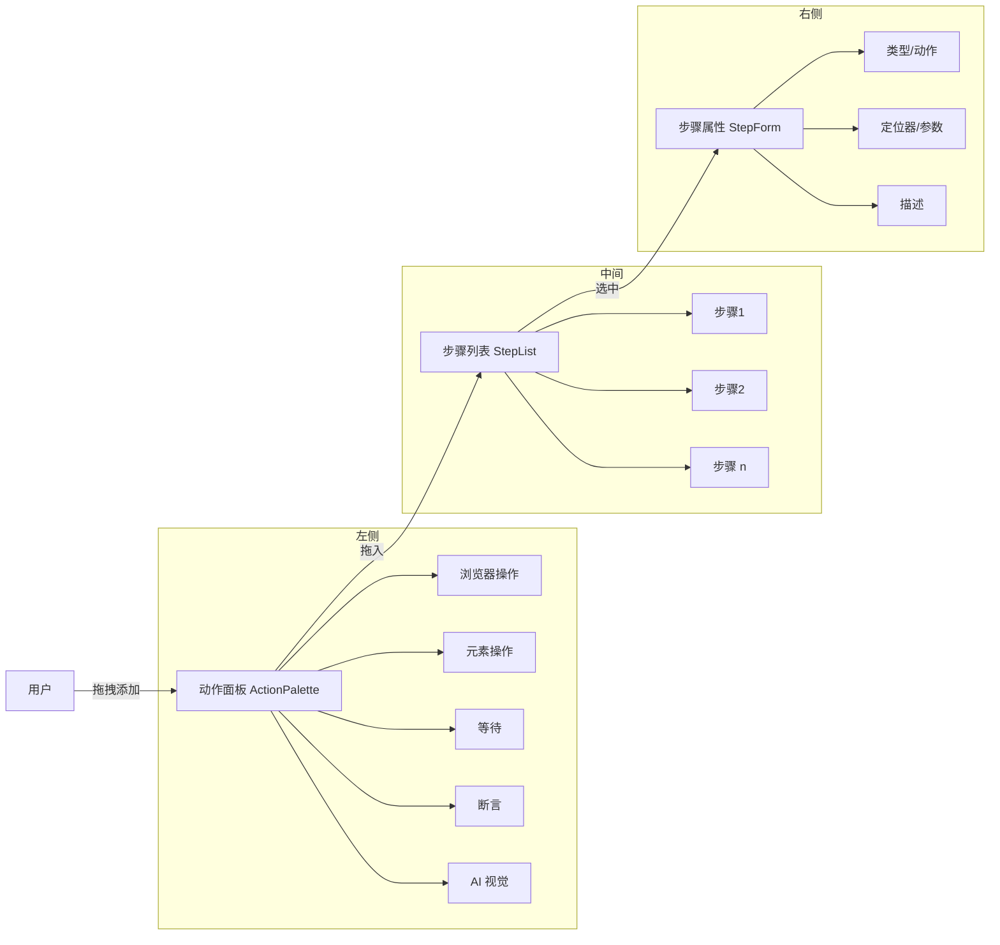

**论文中可写说明**：如图 5-5 所示，可视化编排界面采用三栏布局：左侧为动作面板（ActionPalette），按浏览器操作、元素操作、等待、断言、AI 视觉等分类提供可拖拽动作；中间为步骤列表（StepList），用于展示与调整步骤顺序；右侧为步骤属性表单（StepForm），用于配置类型、动作、定位器与描述等，用户通过“拖入步骤—选中—配置参数”完成编排。

---

**插入位置**：写在「5.3.2 步骤定义与执行调度」中，在介绍 StepDefinition、StepDispatcher 与 StepHandler 接口之后，说明“根据步骤类型和动作分发到具体处理器”时插入。

### 图 5-6 步骤处理器类图

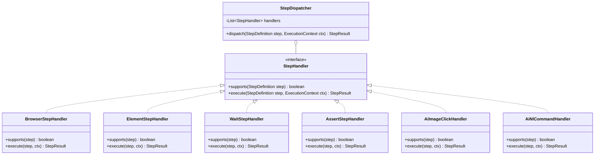

**论文中可写说明**：如图 5-6 所示，步骤执行采用可插拔的处理器架构：StepHandler 接口定义了 supports 与 execute 两个方法，BrowserStepHandler、ElementStepHandler、WaitStepHandler、AssertStepHandler、AiImageClickHandler、AiNlCommandHandler 等分别实现不同步骤类型的处理逻辑，StepDispatcher 通过遍历处理器列表将步骤分发到首个支持该步骤的 Handler 执行，便于后续扩展新的步骤类型。

---

## 5.4 AI 视觉辅助测试模块

**插入位置**：写在「5.4.1 模块位置与当前能力」中，在说明“AI 视觉辅助测试模块以 AiImageClickHandler 形式集成到步骤处理器体系中”之后插入。

### 图 5-7 AI 视觉辅助步骤在执行流程中的位置

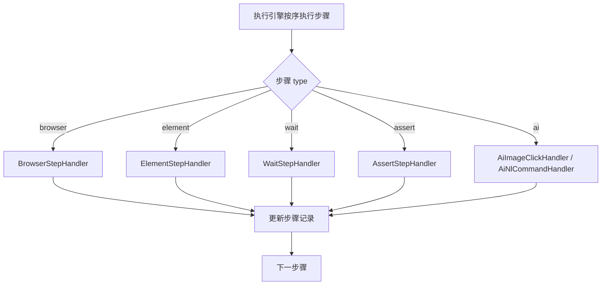

**论文中可写说明**：如图 5-7 所示，AI 视觉辅助步骤与浏览器、元素、等待、断言等步骤类型并列，由执行引擎根据步骤的 type 字段统一分发：当 type 为 ai 时，由 AiImageClickHandler 或 AiNlCommandHandler 处理，执行完成后与其它步骤一样更新步骤记录并进入下一步，从而将 AI 能力无缝融入现有步骤编排与执行流程。

---

**插入位置**：写在「5.4.2 AI 图像点击步骤处理器实现」之后，在说明“真实识别逻辑可后续接入 OpenCV 或外部 AI 服务”时，插入本图作为扩展实现的流程说明。

### 图 5-8 AI 视觉识别流程图（扩展实现参考）

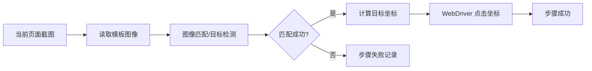

**论文中可写说明**：如图 5-8 所示，完整的 AI 视觉识别流程可扩展为：对当前页面进行截图并读取模板图像，通过图像匹配或目标检测算法进行比对，若匹配成功则计算目标坐标并驱动 WebDriver 在该坐标执行点击，若匹配失败则记录步骤失败并可选保存截图，为后续接入真实识别算法提供清晰的流程参考。

---

## 5.5 测试报告管理模块

**插入位置**：写在「5.5.1 报告数据采集与存储」中，在说明“将每一步执行结果写入 UiExecutionStep、整次执行汇总写入 UiTestExecution”之后，用本图说明执行记录与步骤记录的数据结构关系。

### 图 5-9 执行记录与步骤记录 E-R 图

**矩形为实体**，**菱形为联系**，**1 : N 为联系基数**。执行记录与步骤记录为一对多关系。

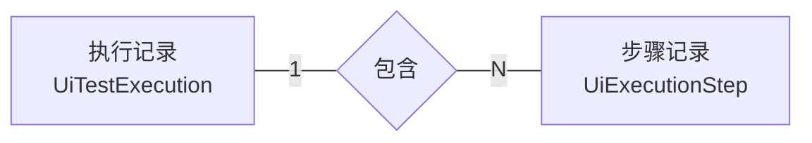

**论文中可写说明**：如图 5-9 所示，测试报告管理以执行记录（UiTestExecution）为核心实体，一次执行对应多条步骤记录（UiExecutionStep），步骤记录中保存步骤序号、类型、动作、状态、截图路径与日志等，便于按执行 ID 查询并组装为前端所需的执行详情与报告内容。

---

**插入位置**：写在「5.5.2 报告接口与前端展示」中，在介绍 getDetail 接口与前端执行结果弹窗、报告列表的衔接时插入。

### 图 5-10 报告数据流与展示结构

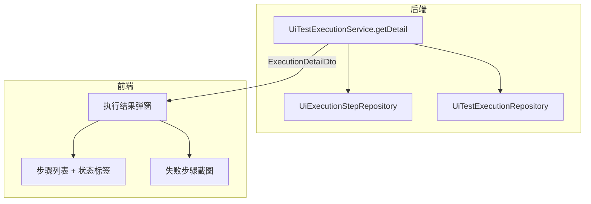

**论文中可写说明**：如图 5-10 所示，报告数据流由后端的 UiTestExecutionService.getDetail 聚合执行记录与步骤记录，通过 ExecutionDetailDto 返回前端；前端在执行结果弹窗中展示步骤列表与状态标签，并对失败步骤展示截图，形成从数据采集到界面展示的完整闭环。

---

**插入位置**：写在「5.5.2」中，在介绍“统计报表与可视化”或“用例通过率、失败分布”时插入，作为报告统计图表的示例说明。

### 图 5-11 用例执行结果统计示意（可作报告图表说明）

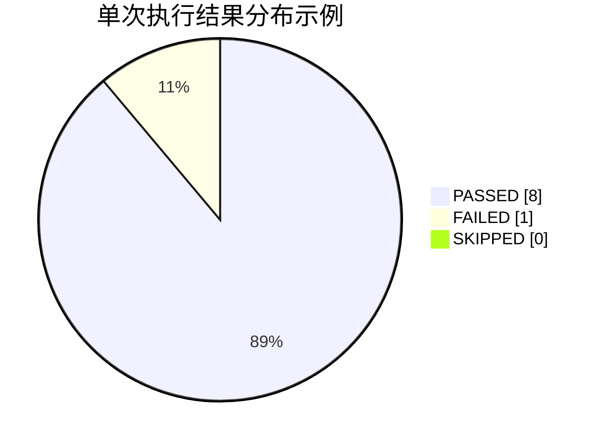

**论文中可写说明**：如图 5-11 所示，单次执行的步骤结果可统计为通过（PASSED）、失败（FAILED）与跳过（SKIPPED）等分布，报告模块可据此生成饼图或柱状图，为测试管理人员提供直观的通过率与失败分布视图。

---

## 5.6 用户与权限管理模块

**插入位置**：写在「5.6.1 认证与会话管理」中，在说明“前端在登录成功后将 Token 存入本地”“通过请求拦截器注入 Authorization”之后插入。

### 图 5-12 登录与 Token 流程时序图

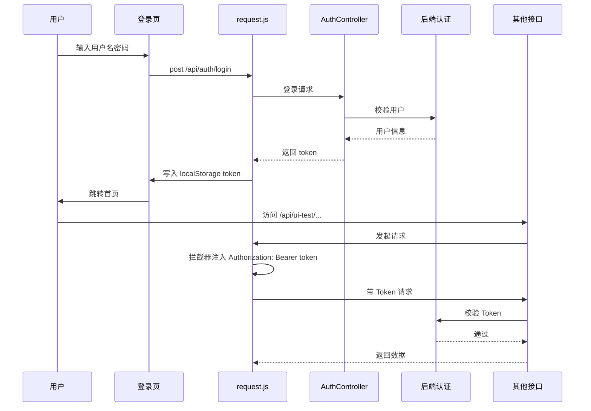

**论文中可写说明**：如图 5-12 所示，用户登录时由前端发起登录请求，经 AuthController 校验后返回 Token，前端将 Token 写入 localStorage 并跳转首页；此后访问受保护接口时，request 拦截器自动在请求头中注入 Bearer Token，后端校验通过后返回数据，从而实现无状态认证与会话延续。

---

**插入位置**：写在「5.6.2 权限控制与审计」中，在说明“采用基于角色的访问控制模型（RBAC）”及“User、Role、Permission 三类实体”时插入。

### 图 5-13 RBAC 权限模型示意图

采用 E-R 图画法：**矩形为实体**（用户、角色、权限），**菱形为联系**，**连线上的 1、N 表示基数**。用户与角色为多对多，角色与权限为多对多。

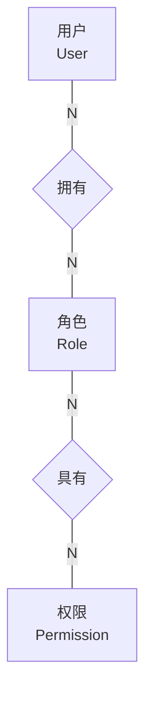

**论文中可写说明**：如图 5-13 所示，系统采用 RBAC 模型实现权限管理：用户（User）通过用户角色关联表（UserRole）拥有多个角色（Role），角色通过角色权限关联表（RolePermission）拥有多个权限（Permission），从而将“用户—角色—权限”解耦，便于按角色批量分配与维护访问控制。

---

**插入位置**：写在「5.6.1」中，在说明“当后端返回 401 时前端清除 Token 并跳转登录页”时插入，用于说明请求链路中的认证与异常处理。

### 图 5-14 请求认证与 401 处理流程

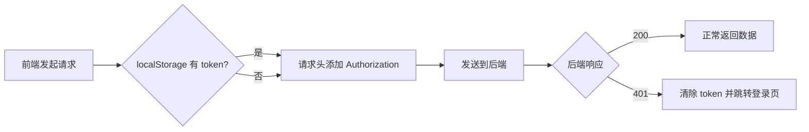

**论文中可写说明**：如图 5-14 所示，前端在发起请求时根据本地是否持有 Token 决定是否添加 Authorization 头，请求发送至后端后根据响应状态处理：若为 200 则正常返回数据，若为 401 则清除本地 Token 并跳转至登录页，从而保证未认证或 Token 失效时用户无法继续访问受保护资源。

---

## 使用说明

1. **渲染与导出**：将上述任意一个 ````mermaid` 代码块复制到 [Mermaid Live Editor](https://mermaid.live) 或 Typora、VS Code（安装 Mermaid 插件）中即可渲染；在 Live Editor 中可导出 PNG/SVG。
2. **插入论文**：在 Word 中可插入「图片」选择导出的 PNG；若使用 LaTeX，可考虑 `mermaid` 相关宏包或先导出 SVG 再转 PDF。
3. **图号与标题**：在论文中引用时请按实际图号修改（如图 5-1、图 5-2），并在图下方注明「图 x-x 某某示意图」。

